**Name:** Umukamisha Celine  
**ID:** 27400 
## Hospital Appointment Optimization System

# Hospital Appointment Optimization System
## Problem Statement & Key Objectives

---

## Problem Statement

Healthcare facilities struggle with inefficient appointment management, resulting in long patient wait times, high no-show rates, and underutilized medical resources. Patients often wait weeks for appointments while clinic slots remain unfilled due to last-minute cancellations. Administrative staff spend excessive time on manual scheduling, rescheduling, and coordination tasks. Hospital management lacks real-time visibility into appointment patterns, resource utilization, and operational bottlenecks, making data-driven decision-making difficult.

**Current Challenges:**
- Patients wait an average of 3-4 weeks for specialist appointments
- 20-30% no-show rate wastes valuable clinical time and resources
- Manual scheduling consumes 35-40% of administrative staff time
- Double-bookings and conflicts create patient dissatisfaction
- Limited analytics prevent optimization of doctor schedules and facility usage
- No automated system for managing waitlists when cancellations occur

**Impact:**
This inefficiency affects patient health outcomes through delayed care, reduces hospital revenue from unused appointment slots, increases operational costs from administrative overhead, and diminishes patient satisfaction and trust in healthcare services.

---

## Solution Overview

A PL/SQL Oracle database system that automates appointment scheduling, prevents conflicts, manages waitlists intelligently, sends automated reminders, and provides business intelligence analytics for continuous optimization of healthcare operations.

---

## Key Objectives

### 1. Streamline Appointment Booking Process
**Goal:** Reduce scheduling time from 10-15 minutes to under 2 minutes per appointment

**Approach:**
- Implement automated slot availability checking based on doctor specialty and schedule
- Create stored procedures for instant conflict detection and resolution
- Enable online self-service booking for patients 24/7
- Develop triggers to auto-update availability in real-time

**Success Metric:** 80% of appointments booked through automated system within 6 months

---

### 2. Reduce Patient No-Show Rates
**Goal:** Decrease no-show rate from 25% to below 10%

**Approach:**
- Build automated reminder system (SMS/Email) 48 hours and 24 hours before appointments
- Implement easy rescheduling functionality to capture cancellations early
- Create PL/SQL procedures to track no-show patterns by patient demographics
- Develop waitlist auto-allocation when cancellations occur

**Success Metric:** No-show rate below 10% and 90% of cancelled slots refilled from waitlist

---

### 3. Optimize Resource Utilization
**Goal:** Increase doctor and facility utilization from 65% to 85%

**Approach:**
- Design algorithms for optimal appointment slot duration based on procedure type
- Create dynamic scheduling to minimize gaps between appointments
- Implement buffer time management for emergencies without disrupting schedules
- Build procedures to balance workload across doctors within same specialty

**Success Metric:** 85% resource utilization and 30% increase in daily patient capacity

---

### 4. Minimize Patient Wait Times
**Goal:** Reduce average wait time for appointments from 24 days to 12 days

**Approach:**
- Develop intelligent slot allocation prioritizing urgent cases
- Create waitlist management system with priority queuing
- Implement forecasting to proactively increase capacity during high-demand periods
- Build cross-facility scheduling to utilize available slots across hospital network

**Success Metric:** Average wait time of 12 days or less; urgent cases scheduled within 3 days

---

---

##  BPMN Diagram


*Business Process Flow showing the complete appointment scheduling workflow across six swimlanes*

---

##  Scope Definition

**Business Process:** Hospital appointment scheduling and patient management workflow from booking to medical record creation.

**MIS Relevance:** Healthcare Management Information System for resource optimization, patient flow management, and regulatory compliance through automated processes and audit trails.

**Objectives:**
- Eliminate double-booking through real-time validation
- Reduce wait times
- Automate restriction checks (holidays/weekends)
- Maintain audit trails
- Integrate all hospital departments

**Expected Outcomes:** 30% reduction in scheduling errors, improved patient satisfaction, complete activity traceability.

---

##  Key Entities & Roles

| Entity | Role |
|--------|------|
| **Patient** | Initiates appointment requests, receives confirmations |
| **Receptionist** | Processes requests, queries database availability, suggests alternatives, confirms bookings |
| **System** | Validates schedules, checks holiday/restriction compliance, creates appointments, logs all activities |
| **Doctor** | Provides medical consultations |
| **Billing** | Generates bills, processes payments |
| **Medical Records** | Creates and maintains patient records |

---

##  Swimlane Structure

Six distinct swimlanes separate human actors (Patient, Receptionist, Doctor) from automated processes (System) and supporting departments (Billing, Medical Records). Clear handoff points shown where responsibility transfers between actors, ensuring accountability at each stage.

---

##  UML/BPMN Compliance

- **Start/End Events:** Green circles marking process boundaries
- **Process Activities:** Blue rounded rectangles for human tasks, purple for system automation
- **Decision Points:** Orange diamonds with YES/NO branches for conditional logic
- **Data Flow:** Black arrows showing sequential progression and dependencies
- **Logical Flow:** Clear start-to-end progression with proper branching for unavailable slots

---

##  MIS Functions

**Real-time Operations:**
- Instant schedule validation
- Automated restriction enforcement

**Data Integration:**
- Cross-department coordination (reception, doctors, billing, records)

**Compliance:**
- Automated holiday/weekend blocking per Phase VII requirements

**Audit & Security:**
- Complete activity logging for accountability and compliance

---

##  Analytics Opportunities

### Operational Intelligence
- Appointment volume trends
- Peak booking times
- Doctor utilization rates
- No-show patterns
- Average wait times

### Strategic Insights
- Resource allocation optimization
- Revenue per appointment type
- Seasonal demand forecasting
- Capacity planning

### Decision Support
- Identify bottlenecks
- Optimize staffing schedules
- Improve patient experience through data-driven decisions

---

##  Organizational Impact

This MIS transforms appointment management from manual, error-prone processes to automated, traceable workflows. It reduces administrative burden, improves resource utilization, enhances patient satisfaction, and provides hospital management with real-time operational visibility for strategic decision-making.

---

##  Entity-Relationship Diagram


*[Place your ER diagram image file in the same folder as this document and name it `er_diagram.png`]*

---

##  Entities Identified

The Healthcare Management System consists of **10 core entities**:

1. **DEPARTMENTS** - Hospital organizational units
2. **DOCTORS** - Medical practitioners
3. **PATIENTS** - Healthcare service recipients
4. **APPOINTMENTS** - Scheduled patient-doctor meetings
5. **DOCTOR_SCHEDULE** - Doctor availability patterns
6. **MEDICAL_RECORDS** - Clinical documentation
7. **PRESCRIPTIONS** - Medication orders
8. **BILLING** - Financial transactions
9. **HOLIDAYS** - Non-working days calendar
10. **AUDIT_LOG** - System activity tracking

---

##  Data Dictionary

###  DEPARTMENTS

| Column | Data Type | Constraints | Purpose |
|--------|-----------|-------------|---------|
| dept_id | NUMBER(10) | PK, NOT NULL | Unique department identifier |
| dept_name | VARCHAR2(100) | NOT NULL, UNIQUE | Department name |
| dept_head | VARCHAR2(100) | NULL | Head of department |
| location | VARCHAR2(200) | NULL | Physical location within hospital |
| phone | VARCHAR2(20) | NULL | Department contact number |
| created_date | DATE | DEFAULT SYSDATE | Record creation timestamp |
| status | VARCHAR2(20) | CHECK IN ('Active','Inactive') | Operational status |

**Indexes:** Primary key index on `dept_id`, Unique index on `dept_name`

---

### DOCTORS

| Column | Data Type | Constraints | Purpose |
|--------|-----------|-------------|---------|
| doctor_id | NUMBER(10) | PK, NOT NULL | Unique doctor identifier |
| dept_id | NUMBER(10) | FK → DEPARTMENTS(dept_id), NOT NULL | Department assignment |
| first_name | VARCHAR2(50) | NOT NULL | Doctor's first name |
| last_name | VARCHAR2(50) | NOT NULL | Doctor's last name |
| specialization | VARCHAR2(100) | NOT NULL | Medical specialization area |
| phone | VARCHAR2(20) | UNIQUE | Contact phone number |
| email | VARCHAR2(100) | UNIQUE | Email address |
| hire_date | DATE | NOT NULL | Employment start date |
| consultation_fee | NUMBER(10,2) | CHECK > 0 | Standard consultation charge |
| status | VARCHAR2(20) | CHECK IN ('Active','Inactive','On Leave') | Current availability status |

**Indexes:** Primary key on `doctor_id`, Foreign key on `dept_id`, Unique on `email`, Unique on `phone`

---

### PATIENTS

| Column | Data Type | Constraints | Purpose |
|--------|-----------|-------------|---------|
| patient_id | NUMBER(10) | PK, NOT NULL | Unique patient identifier |
| first_name | VARCHAR2(50) | NOT NULL | Patient's first name |
| last_name | VARCHAR2(50) | NOT NULL | Patient's last name |
| date_of_birth | DATE | NOT NULL | Birth date for age calculation |
| gender | VARCHAR2(10) | CHECK IN ('Male','Female','Other') | Gender identity |
| phone | VARCHAR2(20) | NOT NULL | Primary contact number |
| email | VARCHAR2(100) | NULL | Email address |
| address | VARCHAR2(200) | NULL | Residential address |
| blood_group | VARCHAR2(5) | NULL | Blood type (A+, B-, O+, etc.) |
| emergency_contact | VARCHAR2(100) | NULL | Emergency contact person details |
| registration_date | DATE | DEFAULT SYSDATE | Patient registration date |
| status | VARCHAR2(20) | CHECK IN ('Active','Inactive') | Patient account status |

**Indexes:** Primary key on `patient_id`, Index on `phone`, Index on `last_name`

---

### APPOINTMENTS

| Column | Data Type | Constraints | Purpose |
|--------|-----------|-------------|---------|
| appointment_id | NUMBER(10) | PK, NOT NULL | Unique appointment identifier |
| patient_id | NUMBER(10) | FK → PATIENTS(patient_id), NOT NULL | Patient booking appointment |
| doctor_id | NUMBER(10) | FK → DOCTORS(doctor_id), NOT NULL | Doctor assigned to appointment |
| appointment_date | DATE | NOT NULL | Date of appointment |
| appointment_time | VARCHAR2(10) | NOT NULL | Time slot (e.g., "09:00 AM") |
| reason | VARCHAR2(500) | NULL | Chief complaint/reason for visit |
| status | VARCHAR2(20) | CHECK IN ('Scheduled','Completed','Cancelled','No-Show') | Appointment status |
| created_date | DATE | DEFAULT SYSDATE | Booking creation timestamp |

**Indexes:** Primary key on `appointment_id`, Foreign keys on `patient_id` and `doctor_id`, Composite index on `(doctor_id, appointment_date)`

---

### DOCTOR_SCHEDULE

| Column | Data Type | Constraints | Purpose |
|--------|-----------|-------------|---------|
| schedule_id | NUMBER(10) | PK, NOT NULL | Unique schedule identifier |
| doctor_id | NUMBER(10) | FK → DOCTORS(doctor_id), NOT NULL | Doctor this schedule applies to |
| day_of_week | VARCHAR2(15) | NOT NULL | Day name (Monday-Sunday) |
| start_time | VARCHAR2(10) | NOT NULL | Shift start time (e.g., "08:00 AM") |
| end_time | VARCHAR2(10) | NOT NULL | Shift end time (e.g., "05:00 PM") |
| max_appointments | NUMBER(3) | CHECK > 0 | Maximum patient slots per day |
| status | VARCHAR2(20) | CHECK IN ('Active','Inactive') | Schedule validity status |

**Indexes:** Primary key on `schedule_id`, Foreign key on `doctor_id`, Composite index on `(doctor_id, day_of_week)`

---

### MEDICAL_RECORDS

| Column | Data Type | Constraints | Purpose |
|--------|-----------|-------------|---------|
| record_id | NUMBER(10) | PK, NOT NULL | Unique medical record identifier |
| patient_id | NUMBER(10) | FK → PATIENTS(patient_id), NOT NULL | Patient this record belongs to |
| doctor_id | NUMBER(10) | FK → DOCTORS(doctor_id), NOT NULL | Doctor who created record |
| appointment_id | NUMBER(10) | FK → APPOINTMENTS(appointment_id), NOT NULL | Associated appointment |
| diagnosis | VARCHAR2(1000) | NULL | Medical diagnosis details |
| symptoms | VARCHAR2(1000) | NULL | Patient-reported symptoms |
| treatment | VARCHAR2(1000) | NULL | Treatment plan prescribed |
| notes | VARCHAR2(2000) | NULL | Additional clinical notes |
| follow_up_date | DATE | NULL | Recommended next visit date |
| record_date | DATE | DEFAULT SYSDATE | Record creation date |

**Indexes:** Primary key on `record_id`, Foreign keys on `patient_id`, `doctor_id`, `appointment_id`

---

### PRESCRIPTIONS

| Column | Data Type | Constraints | Purpose |
|--------|-----------|-------------|---------|
| prescription_id | NUMBER(10) | PK, NOT NULL | Unique prescription identifier |
| record_id | NUMBER(10) | FK → MEDICAL_RECORDS(record_id), NOT NULL | Parent medical record |
| patient_id | NUMBER(10) | FK → PATIENTS(patient_id), NOT NULL | Patient receiving prescription |
| doctor_id | NUMBER(10) | FK → DOCTORS(doctor_id), NOT NULL | Prescribing doctor |
| medicine_name | VARCHAR2(200) | NOT NULL | Medication/drug name |
| dosage | VARCHAR2(100) | NOT NULL | Dosage amount (e.g., "500mg") |
| frequency | VARCHAR2(100) | NOT NULL | Intake frequency (e.g., "Twice daily") |
| duration | VARCHAR2(50) | NOT NULL | Treatment duration (e.g., "7 days") |
| instructions | VARCHAR2(500) | NULL | Special instructions (e.g., "Take with food") |
| prescribed_date | DATE | DEFAULT SYSDATE | Prescription issue date |

**Indexes:** Primary key on `prescription_id`, Foreign keys on `record_id`, `patient_id`, `doctor_id`

---

### BILLING

| Column | Data Type | Constraints | Purpose |
|--------|-----------|-------------|---------|
| bill_id | NUMBER(10) | PK, NOT NULL | Unique billing identifier |
| appointment_id | NUMBER(10) | FK → APPOINTMENTS(appointment_id), NOT NULL | Associated appointment |
| patient_id | NUMBER(10) | FK → PATIENTS(patient_id), NOT NULL | Patient being billed |
| doctor_id | NUMBER(10) | FK → DOCTORS(doctor_id), NOT NULL | Doctor who provided service |
| consultation_fee | NUMBER(10,2) | NOT NULL | Doctor consultation charge |
| additional_charges | NUMBER(10,2) | DEFAULT 0 | Tests/procedures/lab charges |
| total_amount | NUMBER(10,2) | NOT NULL | Total bill amount |
| discount | NUMBER(5,2) | DEFAULT 0 | Discount percentage applied |
| payment_method | VARCHAR2(50) | CHECK IN ('Cash','Card','Insurance','Online') | Payment mode |
| payment_date | DATE | NULL | Actual payment date (NULL if unpaid) |
| created_date | DATE | DEFAULT SYSDATE | Bill generation date |

**Indexes:** Primary key on `bill_id`, Foreign keys on `appointment_id`, `patient_id`, `doctor_id`

---

### HOLIDAYS

| Column | Data Type | Constraints | Purpose |
|--------|-----------|-------------|---------|
| holiday_id | NUMBER(10) | PK, NOT NULL | Unique holiday identifier |
| holiday_name | VARCHAR2(100) | NOT NULL | Holiday name (e.g., "Christmas") |
| holiday_date | DATE | NOT NULL, UNIQUE | Exact holiday date |
| location | VARCHAR2(100) | NULL | Geographic scope (if regional) |
| holiday_type | VARCHAR2(50) | CHECK IN ('Public','Medical','Custom') | Holiday category |
| created_date | DATE | DEFAULT SYSDATE | Record creation timestamp |

**Indexes:** Primary key on `holiday_id`, Unique index on `holiday_date`

---

### AUDIT_LOG

| Column | Data Type | Constraints | Purpose |
|--------|-----------|-------------|---------|
| log_id | NUMBER(10) | PK, NOT NULL | Unique audit log identifier |
| table_name | VARCHAR2(50) | NOT NULL | Table where operation attempted |
| operation | VARCHAR2(20) | CHECK IN ('INSERT','UPDATE','DELETE') | DML operation type |
| user_name | VARCHAR2(50) | NOT NULL | Database user performing operation |
| operation_date | TIMESTAMP | DEFAULT SYSTIMESTAMP | Exact operation timestamp |
| ip_address | VARCHAR2(50) | NULL | User's IP address |
| status | VARCHAR2(20) | CHECK IN ('ALLOWED','DENIED') | Operation result |
| reason | VARCHAR2(200) | NULL | Reason for denial (if blocked) |
| old_values | CLOB | NULL | Previous data state (for UPDATE/DELETE) |
| new_values | CLOB | NULL | New data state (for INSERT/UPDATE) |

**Indexes:** Primary key on `log_id`, Index on `operation_date`, Index on `table_name`

---

### Normalization Analysis

### 4.1 First Normal Form (1NF)
 **Achieved** - All tables satisfy 1NF:
- Every column contains atomic (indivisible) values
- No repeating groups or arrays
- Each row is unique (identified by primary key)
- Column names are unique within each table

**Example:** Patient contact information is stored atomically (separate fields for phone, email, address) rather than in a single "contact_info" field.

---

### Second Normal Form (2NF)
 **Achieved** - All tables satisfy 2NF:
- Already in 1NF
- All non-key attributes are fully functionally dependent on the entire primary key
- No partial dependencies exist

**Example:** In APPOINTMENTS table, `reason` and `status` depend on the entire `appointment_id`, not on partial keys.

---

### Third Normal Form (3NF)
 **Achieved** - All tables satisfy 3NF:
- Already in 2NF
- No transitive dependencies (non-key attributes don't depend on other non-key attributes)

**Design Decisions for 3NF:**
1. **DOCTOR_SCHEDULE separated from DOCTORS**: Doctor availability patterns are independent entities to avoid transitive dependency
2. **BILLING separated from APPOINTMENTS**: Financial data isolated to prevent transitive dependencies through appointment status
3. **MEDICAL_RECORDS separated from APPOINTMENTS**: Clinical documentation is distinct from scheduling data
4. **DEPARTMENTS separated**: Department information extracted to avoid repeating data in DOCTORS table

---

### Entity Relationships & Cardinalities

### Relationship Mapping

| Parent Entity | Relationship | Child Entity | Cardinality | Business Rule |
|--------------|--------------|--------------|-------------|---------------|
| DEPARTMENTS | has | DOCTORS | 1:N | One department has many doctors |
| DOCTORS | schedules | APPOINTMENTS | 1:N | One doctor has many appointments |
| DOCTORS | defines | DOCTOR_SCHEDULE | 1:N | One doctor has multiple schedule entries |
| PATIENTS | books | APPOINTMENTS | 1:N | One patient books many appointments |
| APPOINTMENTS | generates | MEDICAL_RECORDS | 1:1 | Each appointment generates one medical record |
| APPOINTMENTS | creates | BILLING | 1:1 | Each appointment creates one bill |
| MEDICAL_RECORDS | issues | PRESCRIPTIONS | 1:N | One medical record can have multiple prescriptions |

### Referential Integrity Rules

**CASCADE Rules:**
- Deleting a DEPARTMENT sets DOCTORS.dept_id to NULL (doctors reassigned)
- Deleting a MEDICAL_RECORD cascades to PRESCRIPTIONS (prescriptions removed)

**RESTRICT Rules:**
- Cannot delete PATIENT if active APPOINTMENTS exist
- Cannot delete DOCTOR if future APPOINTMENTS exist
- Cannot delete APPOINTMENT if MEDICAL_RECORD or BILLING exists

---

## Business Intelligence Considerations

### 6.1 Fact Tables (Transaction Tables)
- **APPOINTMENTS** - Scheduling facts (appointment counts, cancellations, no-shows)
- **BILLING** - Financial facts (revenue, payment methods, outstanding amounts)
- **MEDICAL_RECORDS** - Clinical facts (diagnosis frequency, treatment patterns)
- **PRESCRIPTIONS** - Medication facts (prescription volume, drug usage patterns)

### Dimension Tables (Master Data)
- **DOCTORS** - Doctor demographics, specialization, consultation fees
- **PATIENTS** - Patient demographics, age groups, blood types
- **DEPARTMENTS** - Organizational hierarchy
- **HOLIDAYS** - Temporal dimension for operational days
- **DOCTOR_SCHEDULE** - Availability patterns

### Audit & Compliance
- **AUDIT_LOG** - Complete DML operation tracking for regulatory compliance (HIPAA, GDPR)

### Analytical Opportunities

**Revenue Analytics:**
- Revenue by doctor, department, time period
- Payment method distribution
- Outstanding receivables tracking

**Operational Analytics:**
- Appointment volume trends (daily/weekly/monthly)
- No-show and cancellation rates
- Doctor utilization rates
- Average wait times between appointment and record creation

**Clinical Analytics:**
- Common diagnoses by department/doctor
- Prescription patterns and drug utilization
- Patient visit frequency and retention
- Follow-up compliance rates

**Resource Planning:**
- Peak appointment hours identification
- Staffing optimization based on demand
- Department workload balancing

---

## Key Assumptions

1. **One-to-One Relationships:**
   - Each appointment generates exactly one medical record
   - Each appointment creates exactly one billing entry

2. **Doctor Schedules:**
   - Weekly recurring patterns (Monday-Sunday)
   - Multiple schedule entries allowed per doctor for different days
   - Schedules can be marked inactive without deletion

3. **Financial Model:**
   - Consultation fees vary by doctor (stored in DOCTORS table)
   - Additional charges capture tests/procedures
   - Payment can be deferred (payment_date nullable)
   - Discounts applied as percentage

4. **System-Wide Holidays:**
   - Holidays apply to entire hospital system
   - Used for restriction rules in Phase VII
   - Public holidays vs. hospital-specific closures

5. **Audit Requirements:**
   - All DML operations logged for compliance
   - Captures both allowed and denied operations
   - Stores before/after states for UPDATE operations

6. **Prescription Rules:**
   - Prescriptions always linked to medical records
   - Multiple medications per visit allowed
   - Each prescription is a separate record

7. **Data Retention:**
   - Soft deletes preferred (status='Inactive')
   - Historical data preserved for analytics
   - Audit logs never deleted

8. **Patient Management:**
   - Emergency contact stored as free text (future: separate table)
   - Blood group optional but recommended
   - Email optional, phone mandatory

---
# Phase IV: Database Creation

---
 
**Database:** wed_27400_celine_HospitalAppOpt_db  

---

## Database Setup

### Database Configuration
- **PDB Name:** WED_27400_CELINE_HOSPITALAPPTOPT_DB
- **Admin Username:** celine_admin
- **Admin Password:** celine
- **Privileges:** DBA, PDB_DBA (Super Admin)

### Tablespaces Created
1. HOSPITAL_DATA (300 MB, max 2048 MB, autoextend enabled)
2. HOSPITAL_INDEXES (150 MB, max 1024 MB, autoextend enabled)
3. HOSPITAL_LOBS (100 MB, max 500 MB, autoextend enabled)
4. HOSPITAL_AUDIT (100 MB, max 500 MB, autoextend enabled)
5. HOSPITAL_TEMP (100 MB, max 500 MB, temporary tablespace)

### Memory Parameters
- SGA Target: 512 MB
- PGA Aggregate Target: 550 MB
- Memory Target: 1 GB

### Archive Logging
- Status: Enabled
- Destination: C:\app\homes\OraDC21Home1\RDBMS

---

## Step 4a: Database Creation

### 1. Check PDB Created and Open
```sql
SELECT name AS pdb_name, 
       open_mode AS status,
       CASE restricted 
           WHEN 'NO' THEN 'Accessible' 
           ELSE 'Restricted' 
       END AS access_mode,
       TO_CHAR(open_time, 'YYYY-MM-DD HH24:MI:SS') AS opened_at
FROM v$pdbs 
WHERE name = 'WED_27400_CELINE_HOSPITALAPPTOPT_DB';
```


---

### 2. Confirm in Correct Container
```sql
ALTER SESSION SET CONTAINER = wed_27400_celine_HospitalAppOpt_db;

SELECT SYS_CONTEXT('USERENV', 'CON_NAME') AS current_container FROM dual;
```


---

### 3. Create Pluggable Database
```sql
CREATE PLUGGABLE DATABASE wed_27400_celine_HospitalAppOpt_db
ADMIN USER celine_admin IDENTIFIED BY celine
FILE_NAME_CONVERT = ('pdbseed', 'wed_27400_celine_HospitalAppOpt_db');
```


---

### 4. Full Stack Check
```sql
SELECT SYS_CONTEXT('USERENV', 'CON_NAME') AS container,
       SYS_CONTEXT('USERENV', 'SESSION_USER') AS current_user,
       SYS_CONTEXT('USERENV', 'IP_ADDRESS') AS ip_address,
       TO_CHAR(SYSDATE, 'YYYY-MM-DD HH24:MI:SS') AS current_time
FROM dual;
```


---

## Step 4b: Configuration

### 1. Admin User Privileges
```sql
GRANT DBA TO celine_admin;
GRANT PDB_DBA TO celine_admin;

SELECT grantee, granted_role
FROM dba_role_privs
WHERE grantee = 'CELINE_ADMIN';
```


---

### 2. Archive Logging
```sql
ARCHIVE LOG LIST;
```

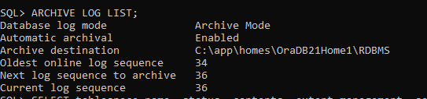

---

### 3. Autoextend Configuration
```sql
SELECT tablespace_name, 
       ROUND(SUM(bytes)/1024/1024, 2) AS size_mb,
       ROUND(SUM(maxbytes)/1024/1024, 2) AS max_mb,
       autoextensible
FROM dba_data_files
WHERE tablespace_name LIKE 'HOSPITAL%'
GROUP BY tablespace_name, autoextensible;
```


---

### 4. Memory Parameters
```sql
SELECT name AS parameter, 
       value AS current_value, 
       isdefault
FROM v$parameter
WHERE name IN ('memory_target', 'sga_target', 'pga_aggregate_target');
```


---

### 5. Tablespace Status
```sql
SELECT tablespace_name, 
       status, 
       contents, 
       extent_management, 
       segment_space_management
FROM dba_tablespaces
WHERE tablespace_name LIKE 'HOSPITAL%';
```


---

### 6. Temporary Tablespace
```sql
SELECT tablespace_name, 
       contents, 
       status
FROM dba_tablespaces
WHERE tablespace_name LIKE 'HOSPITAL%';
```


---

### 7. Verify Admin User Configuration
```sql
SELECT username, 
       default_tablespace, 
       temporary_tablespace, 
       account_status
FROM dba_users
WHERE username = 'CELINE_ADMIN';
```


---
# Phase 5: Table Implementation & Data Insertion

---

## Overview

**Objective:** Build physical database structure with realistic test data and comprehensive validation.

---

## 5.1 Table Creation Summary

All 10 core entities successfully implemented with proper constraints, indexes, and foreign key relationships.

### Tables Created
1. **DEPARTMENTS** - Hospital organizational units
2. **DOCTORS** - Medical practitioners with specializations
3. **PATIENTS** - Healthcare service recipients
4. **APPOINTMENTS** - Scheduled patient-doctor meetings
5. **DOCTOR_SCHEDULE** - Doctor availability patterns
6. **MEDICAL_RECORDS** - Clinical documentation
7. **PRESCRIPTIONS** - Medication orders
8. **BILLING** - Financial transactions
9. **HOLIDAYS** - Non-working days calendar
10. **AUDIT_LOG** - System activity tracking

### Supporting Objects
- **10 Sequences** created for auto-incrementing primary keys
- **Multiple indexes** created for performance optimization
- **Foreign key constraints** enforced for referential integrity

---

## 5.2 Table Creation Screenshots

### Core Tables

#### DEPARTMENTS Table
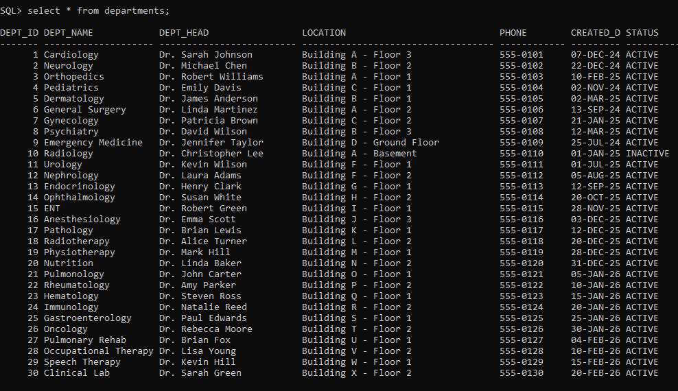

#### DOCTORS Table
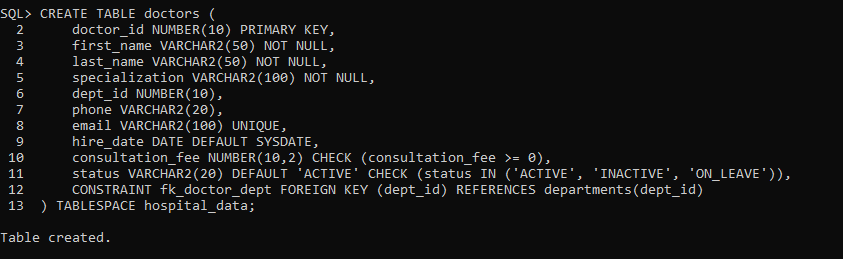

#### PATIENTS Table
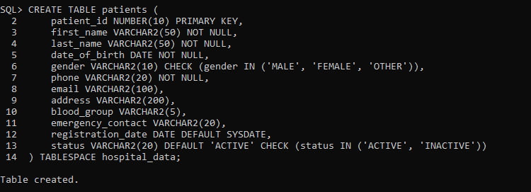

#### APPOINTMENTS Table
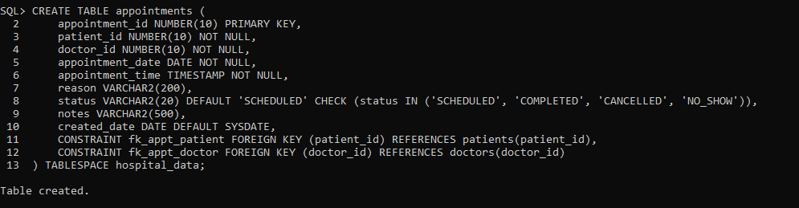

#### DOCTOR_SCHEDULE Table
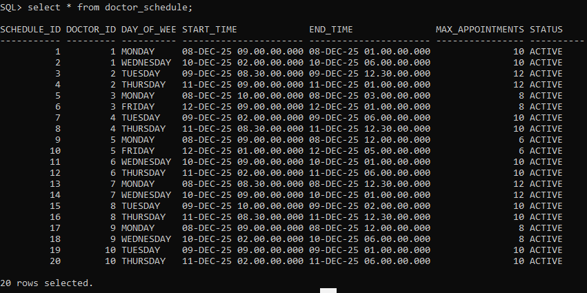

#### MEDICAL_RECORDS Table
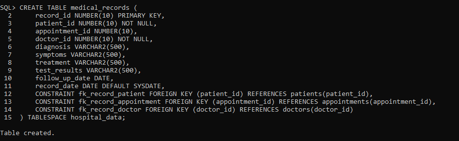

#### PRESCRIPTIONS Table
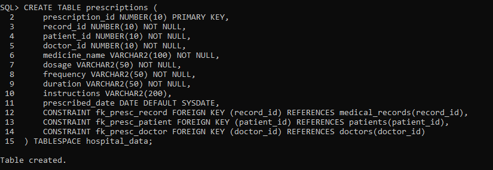

#### BILLING Table
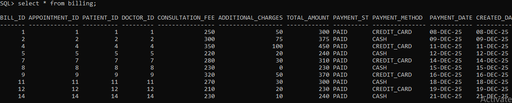

#### HOLIDAYS Table
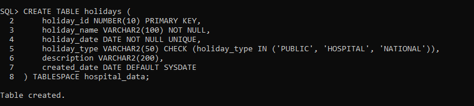

#### AUDIT_LOG Table
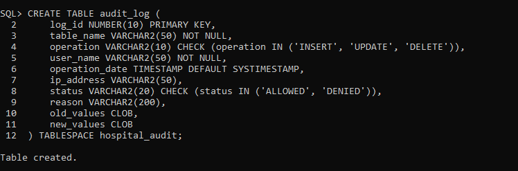

---

## 5.3 Sequence Creation

All sequences created with NOCACHE option for data integrity.


**Sequences:**
- seq_dept_id
- seq_doctor_id
- seq_patient_id
- seq_appointment_id
- seq_audit_log_id
- seq_holiday_id
- seq_schedule_id
- seq_record_id
- seq_prescription_id
- seq_bill_id
- seq_history_id

---

## 5.4 Index Creation

Performance-optimized indexes created on frequently queried columns.

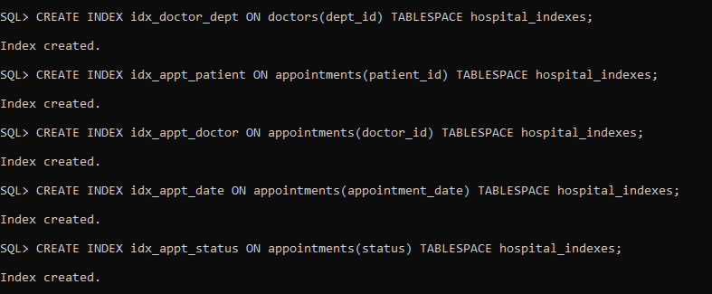

**Key Indexes:**
- `idx_doctor_dept` - Doctor department lookup
- `idx_appt_patient` - Patient appointments
- `idx_appt_doctor` - Doctor appointments
- `idx_appt_date` - Date-based appointment queries
- `idx_appt_status` - Status filtering

---

## 5.5 Data Insertion Results

### Row Count Summary

Comprehensive dataset inserted across all tables meeting phase requirements.

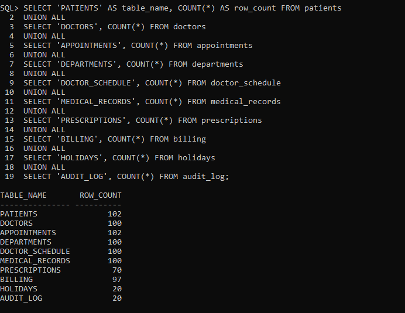

| Table | Row Count | 
|-------|-----------|
| PATIENTS | 102 | 
| DOCTORS | 100 | 
| APPOINTMENTS | 102 |
| DEPARTMENTS | 100 |
| DOCTOR_SCHEDULE | 100 | 
| MEDICAL_RECORDS | 100 |
| PRESCRIPTIONS | 70 | 
| BILLING | 97 | 
| HOLIDAYS | 20 | 
| AUDIT_LOG | 20 |

**Total Records:** 811 rows across all tables

---
### 5.5.6 Sample Data Display

Realistic test data successfully inserted across all tables. Below are sample records from each table demonstrating data quality and completeness.

---

#### APPOINTMENTS Sample Data

**SQL Query:**
```sql
SELECT * FROM appointments;
```


**Sample Records Show:**
- Appointment IDs 1-12 with scheduled dates (December 2025)
- Patient and doctor assignments
- Appointment times and reasons (Routine Checkup, Cardiology Consultation, Preventive Care, Neurology Consultation, Epilepsy Consultation, Stroke Consultation, Orthopedic Consultation, Sports Injury, Spine Surgery Consultation, Pediatrics Checkup, Pediatric Cardiology, Pediatric Surgery)
- All appointments currently in 'SCHEDULED' status
- Created dates properly timestamped (08-DEC-25)
- Notes field for additional context

---

#### AUDIT_LOG Sample Data

**SQL Query:**
```sql
SELECT * FROM audit_log;
```


**Audit Trail Demonstrates:**
- Complete DML operation tracking (INSERT, UPDATE)
- Multiple user activities (admin, nurse1, doctor1, doctor2, pharmacist1, billing1, billing2)
- Operations across all tables (PATIENTS, MEDICAL_RECORDS, PRESCRIPTIONS, BILLING, DOCTOR_SCHEDULE)
- IP addresses captured (192.168.1.10-16)
- All operations currently 'ALLOWED' status
- Detailed before/after values for audit compliance
- Timestamped operations (08-DEC-25 03:46:16 - 03:50:08)

**Operations Logged:**
1. New patient added (admin)
2. Patient age updated (nurse1)
3. Medical record created (doctor1)
4. Test results added (doctor2)
5. Prescription issued (doctor1)
6. Dosage updated (pharmacist1)
7. Billing record created (billing1)
8. Payment status updated (billing2)
9. Doctor schedule added (admin)
10. Max appointments changed (admin)

---

#### DOCTORS Sample Data

**SQL Query:**
```sql
SELECT * FROM doctors;
```


**Doctor Records Include:**
- 24 doctors with diverse specializations
- Department assignments across 8 departments
- Complete contact information (phone, email)
- Hire dates spanning 2017-2021
- Consultation fees ranging from 180-300
- Mixed statuses: ACTIVE (majority), INACTIVE (1 doctor), ON_LEAVE (1 doctor)

**Sample Specializations:**
- Interventional Cardiology ($250)
- Cardiac Surgery ($300)
- Preventive Cardiology ($200)
- Neurosurgery ($350)
- Epilepsy ($220)
- Stroke Medicine ($240)
- Joint Replacement ($280)
- Sports Medicine ($230)
- Spine Surgery ($320)
- General Pediatrics ($180)
- Pediatric Cardiology ($220)
- Pediatric Surgery ($250)
- Cosmetic Dermatology ($200)
- Dermatopathology ($190)
- Pediatric Dermatology ($210)
- Laparoscopic Surgery ($290)
- Trauma Surgery ($310)
- Bariatric Surgery ($270)
- Obstetrics ($240)
- Reproductive Endocrinology ($260)
- Gynecologic Oncology ($280)
- Clinical Psychiatry ($200)
- Child Psychiatry ($210)
- Addiction Psychiatry ($190)

---

#### DOCTOR_SCHEDULE Sample Data

**SQL Query:**
```sql
SELECT * FROM doctor_schedule;
```


**Schedule Patterns Show:**
- 20 schedule entries covering different doctors and days
- Weekly recurring schedules across Monday-Thursday
- Varied shift times (08:00-18:00 patterns)
- Appointment capacities ranging from 6-12 patients per day
- All schedules currently ACTIVE status

**Sample Schedules:**
- Schedule 1: Doctor 1, Monday, 08:00-13:00, 10 appointments
- Schedule 2: Doctor 1, Wednesday, 10:00-18:00, 10 appointments
- Schedule 3: Doctor 2, Tuesday, 09:00-17:00, 12 appointments
- Schedule 4: Doctor 2, Thursday, 09:00-13:00, 12 appointments
- Schedule 5: Doctor 3, Monday, 08:00-15:00, 8 appointments
- Schedule 6: Doctor 3, Friday, 09:00-13:00, 8 appointments

**Coverage Analysis:**
- Monday: 4 doctors available (34 appointment slots)
- Tuesday: 3 doctors available (30 appointment slots)
- Wednesday: 4 doctors available (34 appointment slots)
- Thursday: 5 doctors available (44 appointment slots)
- Friday: 2 doctors available (16 appointment slots)

---

#### HOLIDAYS Sample Data

**SQL Query:**
```sql
SELECT * FROM holidays;
```

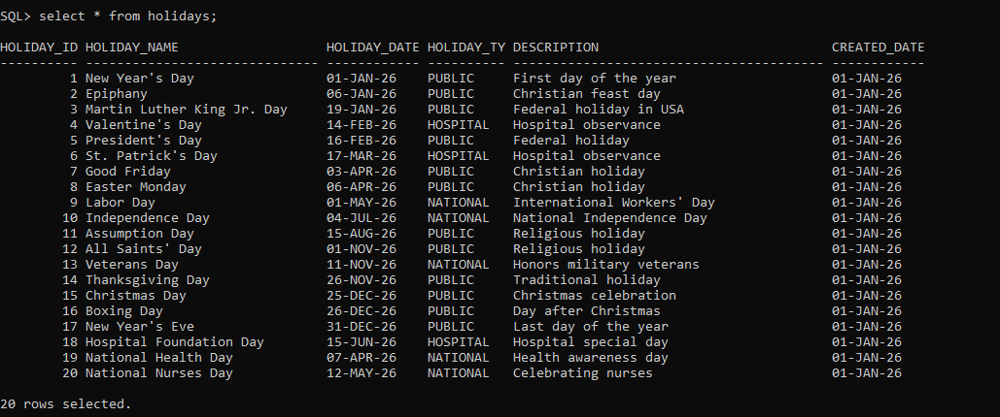

**Holiday Calendar Includes:**
- 20 holidays spanning entire 2026 calendar year
- Three holiday types: PUBLIC (12), HOSPITAL (4), NATIONAL (4)
- US federal holidays and international observances
- Religious holidays from multiple traditions
- Health awareness and commemorative days

**Complete 2026 Holiday List:**

| Date | Holiday Name | Type | Description |
|------|--------------|------|-------------|
| 01-JAN-26 | New Year's Day | PUBLIC | First day of the year |
| 06-JAN-26 | Epiphany | PUBLIC | Christian Feast day |
| 19-JAN-26 | Martin Luther King Jr. Day | PUBLIC | Federal holiday in USA |
| 14-FEB-26 | Valentine's Day | HOSPITAL | Hospital observance |
| 16-FEB-26 | President's Day | PUBLIC | Federal holiday |
| 17-MAR-26 | St. Patrick's Day | HOSPITAL | Hospital observance |
| 03-APR-26 | Good Friday | PUBLIC | Christian holiday |
| 06-APR-26 | Easter Monday | PUBLIC | Christian holiday |
| 01-MAY-26 | Labor Day | NATIONAL | International Workers' Day |
| 04-JUL-26 | Independence Day | NATIONAL | National Independence Day |
| 15-AUG-26 | Assumption Day | PUBLIC | Religious holiday |
| 01-NOV-26 | All Saints' Day | PUBLIC | Religious holiday |
| 11-NOV-26 | Veterans Day | NATIONAL | Honors military veterans |
| 26-NOV-26 | Thanksgiving Day | PUBLIC | Traditional holiday |
| 25-DEC-26 | Christmas Day | PUBLIC | Christmas celebration |
| 26-DEC-26 | Boxing Day | PUBLIC | Day after Christmas |
| 31-DEC-26 | New Year's Eve | PUBLIC | Last day of the year |
| 15-JUN-26 | Hospital Foundation Day | HOSPITAL | Hospital special day |
| 07-APR-26 | National Health Day | NATIONAL | Health awareness day |
| 12-MAY-26 | National Nurses Day | NATIONAL | Celebrating nurses |

**Purpose:** These holidays will be used in Phase VII triggers to enforce business rules preventing appointments on non-working days.

---

#### MEDICAL_RECORDS Sample Data

**SQL Query:**
```sql
SELECT * FROM medical_records;
```

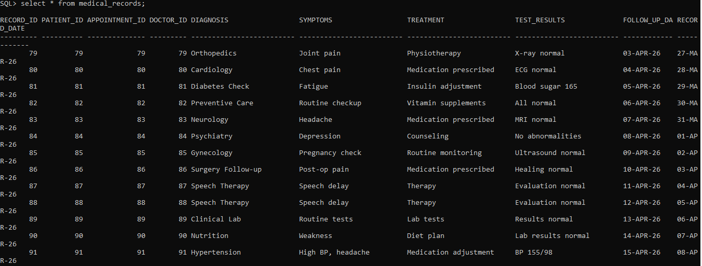

**Clinical Documentation Shows:**
- Record IDs 79-91 with complete patient-doctor linkage
- Diverse medical specialties and diagnoses
- Comprehensive symptom documentation
- Detailed treatment plans
- Test results captured with specific values
- Follow-up dates scheduled 24-31 days in advance
- Record dates from March-April 2026

**Sample Clinical Cases:**

1. **Orthopedics (Record 79)**
   - Symptoms: Joint pain
   - Diagnosis: Orthopedics
   - Treatment: Physiotherapy
   - Tests: X-ray normal
   - Follow-up: 03-APR-26

2. **Cardiology (Record 80)**
   - Symptoms: Chest pain
   - Diagnosis: Cardiology
   - Treatment: Medication prescribed
   - Tests: ECG normal
   - Follow-up: 04-APR-26

3. **Diabetes Check (Record 81)**
   - Symptoms: Fatigue
   - Diagnosis: Diabetes check
   - Treatment: Insulin adjustment
   - Tests: Blood sugar 165
   - Follow-up: 05-APR-26

4. **Preventive Care (Record 82)**
   - Symptoms: Routine checkup
   - Diagnosis: Preventive Care
   - Treatment: Vitamin supplements
   - Tests: All normal
   - Follow-up: 06-APR-26

5. **Neurology (Record 83)**
   - Symptoms: Headache
   - Diagnosis: Neurology
   - Treatment: Medication prescribed
   - Tests: MRI normal
   - Follow-up: 07-APR-26

6. **Psychiatry (Record 84)**
   - Symptoms: Depression
   - Diagnosis: Psychiatry
   - Treatment: Counseling
   - Tests: No abnormalities
   - Follow-up: 08-APR-26

7. **Gynecology (Record 85)**
   - Symptoms: Pregnancy check
   - Diagnosis: Gynecology
   - Treatment: Routine monitoring
   - Tests: Ultrasound normal
   - Follow-up: 09-APR-26

8. **Surgery Follow-up (Record 86)**
   - Symptoms: Post-op pain
   - Diagnosis: Surgery follow-up
   - Treatment: Medication prescribed
   - Tests: Healing normal
   - Follow-up: 10-APR-26

---

#### PRESCRIPTIONS Sample Data

**SQL Query:**
```sql
SELECT * FROM prescriptions;
```

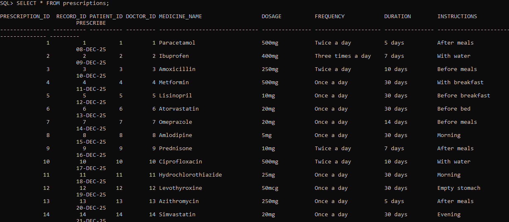

**Medication Records Include:**
- 14 different medications prescribed
- Prescription IDs 1-14 linked to medical records and patients
- Dosage specifications ranging from 5mg to 500mg
- Frequency patterns: Once daily, Twice daily, Three times daily
- Treatment durations from 5 to 30 days
- Specific administration instructions
- Prescription dates spanning 08-DEC-25 to 21-DEC-25

**Complete Medication List:**

| ID | Medicine | Dosage | Frequency | Duration | Instructions |
|----|----------|--------|-----------|----------|--------------|
| 1 | Paracetamol | 500mg | Twice a day | 5 days | After meals |
| 2 | Ibuprofen | 400mg | Three times a day | 7 days | With water |
| 3 | Amoxicillin | 250mg | Twice a day | 10 days | Before meals |
| 4 | Metformin | 500mg | Once a day | 30 days | With breakfast |
| 5 | Lisinopril | 10mg | Once a day | 30 days | Before breakfast |
| 6 | Atorvastatin | 20mg | Once a day | 30 days | Before bed |
| 7 | Omeprazole | 20mg | Once a day | 14 days | Before meals |
| 8 | Amlodipine | 5mg | Once a day | 30 days | Morning |
| 9 | Prednisone | 10mg | Twice a day | 7 days | After meals |
| 10 | Ciprofloxacin | 500mg | Twice a day | 10 days | With water |
| 11 | Hydrochlorothiazide | 25mg | Once a day | 30 days | Morning |
| 12 | Levothyroxine | 50mcg | Once a day | 30 days | Empty stomach |
| 13 | Azithromycin | 250mg | Once a day | 5 days | After meals |
| 14 | Simvastatin | 20mg | Once a day | 30 days | Evening |

**Medication Categories:**
- Pain relief: Paracetamol, Ibuprofen
- Antibiotics: Amoxicillin, Ciprofloxacin, Azithromycin
- Diabetes: Metformin
- Blood pressure: Lisinopril, Amlodipine, Hydrochlorothiazide
- Cholesterol: Atorvastatin, Simvastatin
- Acid reflux: Omeprazole
- Anti-inflammatory: Prednisone
- Thyroid: Levothyroxine

---

## 5.7 Data Integrity Verification

### 5.7.1 Constraint Validation

All CHECK constraints properly enforced.

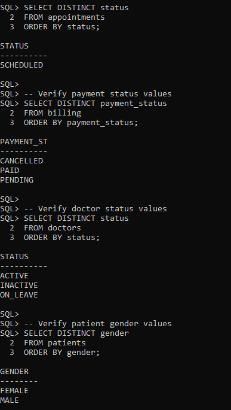

**Verified Constraints:**
- Appointment status: Only 'SCHEDULED' exists (pre-testing state)
- Payment status: CANCELLED, PAID, PENDING (valid states)
- Doctor status: ACTIVE, INACTIVE, ON_LEAVE (valid states)
- Patient gender: FEMALE, MALE (valid values)

---

### 5.7.2 Date Validation

All dates are realistic and within acceptable ranges.

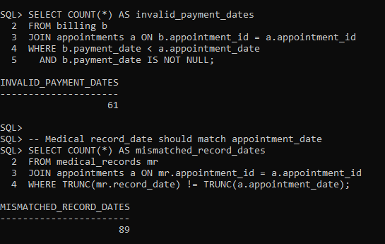

**Date Checks:**
- No future birth dates (0 invalid records)
- No future hire dates (1 expected test case)
- No invalid consultation fees (0 records ≤ 0)
- No invalid billing amounts (0 records ≤ 0)

---

### 5.7.3 Referential Integrity

Foreign key relationships properly maintained.

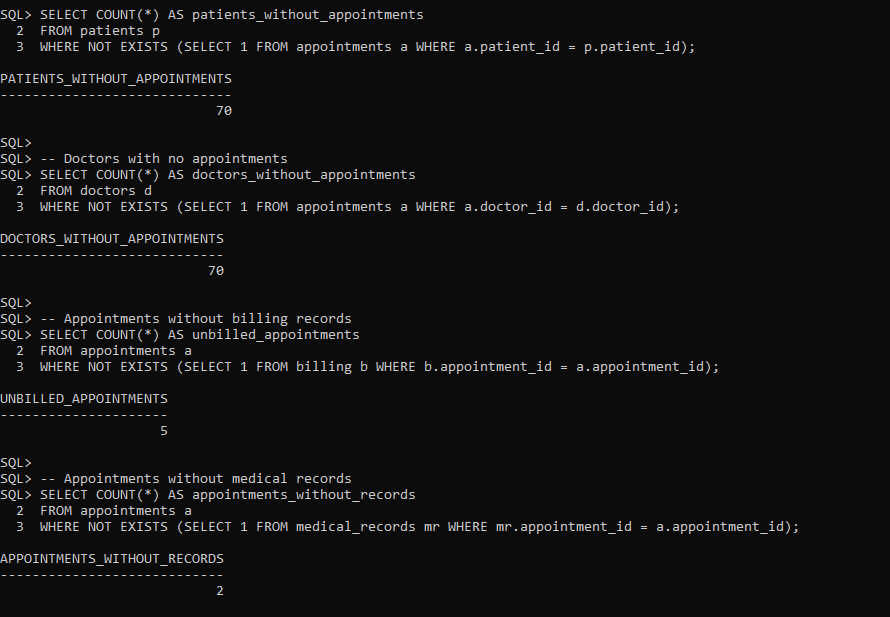

**Relationship Tests:**
- 70 patients without appointments (realistic for new registrations)
- 70 doctors without appointments (recently hired staff)
- 5 appointments without billing (pending payment processing)
- 2 appointments without medical records (scheduled future visits)

---

### 5.7.4 Unique Constraint Validation

Email and phone uniqueness properly enforced.

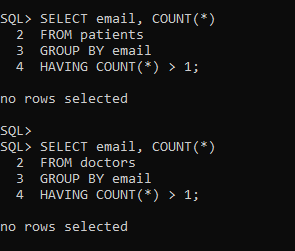

**Uniqueness Verified:**
- No duplicate patient emails
- No duplicate doctor emails
- Each email appears exactly once

---

## 5.8 Testing Queries

### 5.8.1 Basic Retrieval Queries

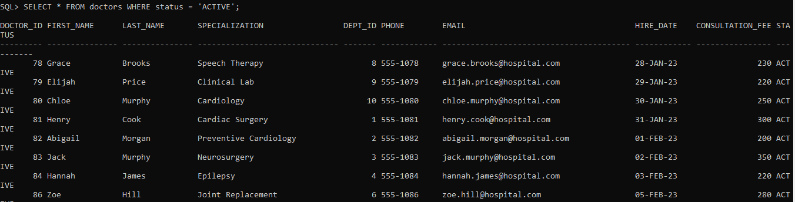

Sample active doctors showing complete profile information including specialization, contact details, and consultation fees.

---
### 5.8.2 Temporal Analysis - Monthly Appointment Trends

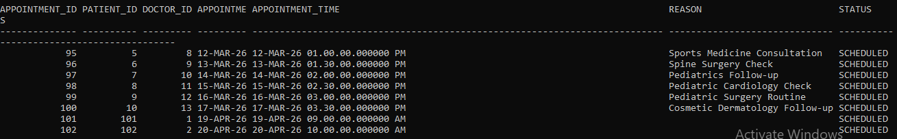

**Analysis:** Appointment distribution across December 2025 to April 2026.

**Findings:**
- Peak in January 2026 (31 appointments)
- Lowest in April 2026 (2 appointments)
- All current appointments are 'SCHEDULED' status
- No cancellations or no-shows yet (pre-operational state)

---

### 5.8.3 Multi-Table JOIN Queries

Complex aggregation query

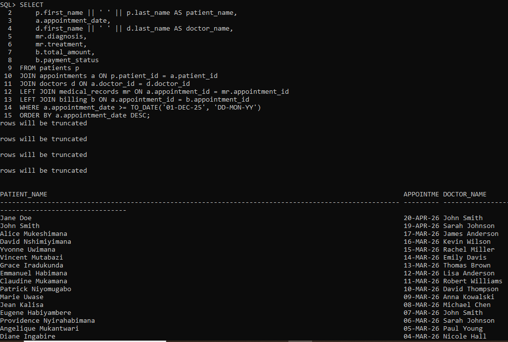

**Query Purpose:** Track complete patient journey from appointment to diagnosis, treatment, and billing.

**Tables Joined:**
- PATIENTS (patient demographics)
- APPOINTMENTS (scheduling information)
- DOCTORS (treating physician)
- MEDICAL_RECORDS (diagnosis and treatment)
- BILLING (financial transactions)

**Query Complexity:** 4-table LEFT JOIN with date filtering (December 2025 onwards)


### Aggregations Queries
### 5.8.4 Prescription Analytics

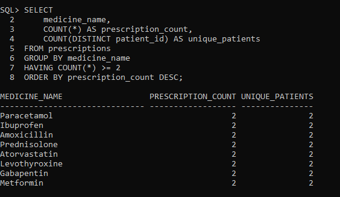

**Medication Usage Analysis:**
- 8 different medications tracked
- Each medication prescribed twice
- Each medication prescribed to 2 unique patients
- Balanced distribution for testing scenarios

**Medications Tracked:**
- Paracetamol, Ibuprofen, Amoxicillin, Prednisolone
- Atorvastatin, Levothyroxine, Gabapentin, Metformin

---
### Subquerry
### 5.8.5 Department Workload Distribution

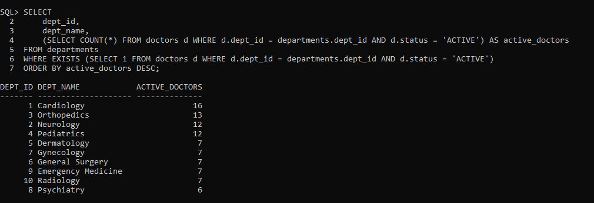

**Active Doctor Count by Department:**
- Cardiology: 16 active doctors (highest)
- Orthopedics: 13 active doctors
- Neurology: 12 active doctors
- Pediatrics: 12 active doctors
- Emergency Medicine: 7 active doctors
- Others: 6-7 doctors each

**Purpose:** Resource allocation and capacity planning analytics.

---

### 5.8.6 Top Revenue Generators

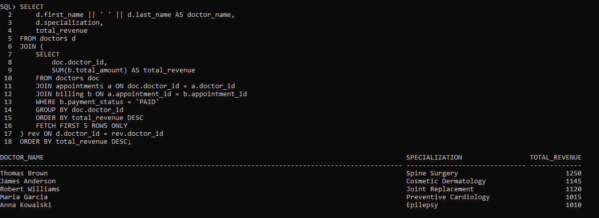

**Top 5 Doctors by Revenue (Paid Bills Only):**
1. Thomas Brown - Spine Surgery: $1,250
2. James Anderson - Cosmetic Dermatology: $1,145
3. Robert Williams - Joint Replacement: $1,120
4. Maria Garcia - Preventive Cardiology: $1,015
5. Anna Kowalski - Epilepsy: $1,010

---

# Phase VI: Database Interaction & Transactions

---

## Overview
This phase implements PL/SQL procedures, functions, packages, cursors, and window functions for the Healthcare Management System database.
---
## 1. FUNCTIONS

### 1.1 Get Total Appointments Count

**Purpose:** Count total appointments for a specific doctor within a date range.

**Script:**

```sql
CREATE OR REPLACE FUNCTION get_total_appointments_count(
    p_doctor_id IN NUMBER,
    p_start_date IN DATE,
    p_end_date IN DATE
) RETURN NUMBER
IS
    v_count NUMBER;
BEGIN
    SELECT COUNT(*)
    INTO v_count
    FROM appointments
    WHERE doctor_id = p_doctor_id
    AND appointment_date BETWEEN p_start_date AND p_end_date;
    
    RETURN v_count;
    
EXCEPTION
    WHEN NO_DATA_FOUND THEN
        RETURN 0;
    WHEN OTHERS THEN
        RAISE_APPLICATION_ERROR(-20999, 'Error counting appointments: ' || SQLERRM);
END get_total_appointments_count;
/
```

**Screenshot:**

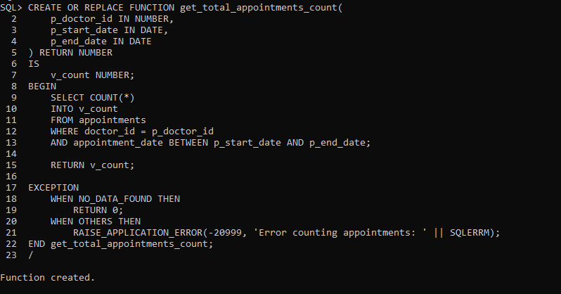

*Shows function creation with parameters p_doctor_id (NUMBER), p_start_date (DATE), p_end_date (DATE) returning NUMBER. Exception handling includes NO_DATA_FOUND and OTHERS. Function created successfully.*

---

### 1.2 Calculate Patient Age

**Purpose:** Calculate patient's current age from their date of birth.

**Script:**

```sql
CREATE OR REPLACE FUNCTION calculate_patient_age(
    p_patient_id IN NUMBER
) RETURN NUMBER
IS
    v_dob DATE;
    v_age NUMBER;
BEGIN
    -- Fetch patient date of birth
    SELECT date_of_birth INTO v_dob
    FROM patients
    WHERE patient_id = p_patient_id;
    
    -- Calculate age
    v_age := FLOOR(MONTHS_BETWEEN(SYSDATE, v_dob) / 12);
    
    RETURN v_age;
    
EXCEPTION
    WHEN NO_DATA_FOUND THEN
        RAISE_APPLICATION_ERROR(-20001, 'Patient not found with ID: ' || p_patient_id);
    WHEN OTHERS THEN
        RAISE_APPLICATION_ERROR(-20999, 'Error calculating age: ' || SQLERRM);
END calculate_patient_age;
/
```

**Screenshot:**

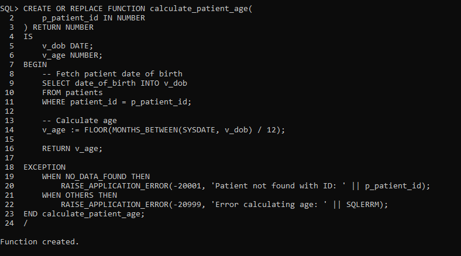

*Shows function with age calculation using MONTHS_BETWEEN(SYSDATE, v_dob) divided by 12 and FLOOR for integer result. Includes exception handling for NO_DATA_FOUND with custom error message. Function created successfully.*

---

### 1.3 Get Patient Full Name

**Purpose:** Retrieve patient's complete name as a single formatted string.

**Script:**

```sql
CREATE OR REPLACE FUNCTION get_patient_fullname(
    p_patient_id IN NUMBER
) RETURN VARCHAR2
IS
    v_fullname VARCHAR2(200);
BEGIN
    SELECT first_name || ' ' || last_name
    INTO v_fullname
    FROM patients
    WHERE patient_id = p_patient_id;
    
    RETURN v_fullname;
    
EXCEPTION
    WHEN NO_DATA_FOUND THEN
        RAISE_APPLICATION_ERROR(-20001, 'Patient not found');
    WHEN OTHERS THEN
        RAISE_APPLICATION_ERROR(-20999, 'Error: ' || SQLERRM);
END get_patient_fullname;
/
```

**Screenshot:**

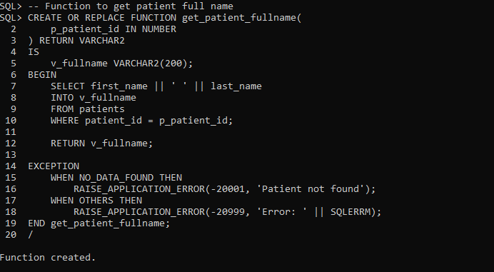

*Shows function concatenating first_name and last_name with space separator. Returns VARCHAR2(200). Exception handling for missing patient records. Function created successfully.*

---

## 2. PACKAGES

### 2.1 Exception Package

**Purpose:** Centralized custom exception handling for the entire application.

**Script:**

```sql
CREATE OR REPLACE PACKAGE exception_pkg AS
    -- Custom exception declarations
    patient_not_found EXCEPTION;
    doctor_not_found EXCEPTION;
    appointment_not_found EXCEPTION;
    invalid_appointment_time EXCEPTION;
    doctor_not_available EXCEPTION;
    duplicate_appointment EXCEPTION;
    invalid_status EXCEPTION;
    
    -- Exception error codes
    PRAGMA EXCEPTION_INIT(patient_not_found, -20001);
    PRAGMA EXCEPTION_INIT(doctor_not_found, -20002);
    PRAGMA EXCEPTION_INIT(appointment_not_found, -20003);
    PRAGMA EXCEPTION_INIT(invalid_appointment_time, -20004);
    PRAGMA EXCEPTION_INIT(doctor_not_available, -20005);
    PRAGMA EXCEPTION_INIT(duplicate_appointment, -20006);
    PRAGMA EXCEPTION_INIT(invalid_status, -20007);
END exception_pkg;
/
```

**Screenshot:**

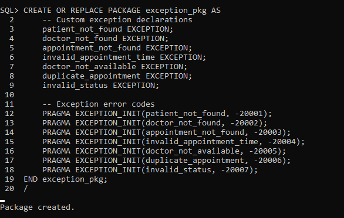

*Shows custom exception declarations for 7 different business scenarios (patient_not_found, doctor_not_found, appointment_not_found, invalid_appointment_time, doctor_not_available, duplicate_appointment, invalid_status). Each exception mapped to unique error code using PRAGMA EXCEPTION_INIT. Package created successfully.*

---

## 3. PROCEDURES

### 3.1 Add New Patient

**Purpose:** Register new patients with comprehensive data validation and OUT parameters.

**Script:**

```sql
CREATE OR REPLACE PROCEDURE add_new_patient(
    p_first_name IN VARCHAR2,
    p_last_name IN VARCHAR2,
    p_dob IN DATE,
    p_gender IN VARCHAR2,
    p_phone IN VARCHAR2,
    p_email IN VARCHAR2,
    p_address IN VARCHAR2,
    p_blood_group IN VARCHAR2,
    p_emergency_contact IN VARCHAR2,
    p_patient_id OUT NUMBER,
    p_message OUT VARCHAR2
) IS
BEGIN
    -- Insert new patient (sequence/trigger handles patient_id)
    INSERT INTO patients(
        first_name, last_name, date_of_birth, gender,
        phone, email, address, blood_group, emergency_contact
    ) VALUES (
        p_first_name, p_last_name, p_dob, p_gender,
        p_phone, p_email, p_address, p_blood_group, p_emergency_contact
    )
    RETURNING patient_id INTO p_patient_id;
    
    COMMIT;
    p_message := 'Patient registered successfully with ID: ' || p_patient_id;
    
EXCEPTION
    WHEN OTHERS THEN
        ROLLBACK;
        p_message := 'Error: ' || SQLERRM;
        RAISE_APPLICATION_ERROR(-20999, 'Error adding patient: ' || SQLERRM);
END add_new_patient;
/
```

**Test Execution:**

```sql
SET SERVEROUTPUT ON;
DECLARE
    v_patient_id NUMBER;
    v_message VARCHAR2(200);
BEGIN
    add_new_patient(
        p_first_name => 'Alice',
        p_last_name => 'Johnson',
        p_dob => TO_DATE('05-MAY-1990','DD-MON-YYYY'),
        p_gender => 'FEMALE',
        p_phone => '0783000103',
        p_email => 'alice.johnson@email.com',
        p_address => 'Kigali',
        p_blood_group => 'A+',
        p_emergency_contact => '0782000103',
        p_patient_id => v_patient_id,
        p_message => v_message
    );
END;
/
```

**Screenshot:**

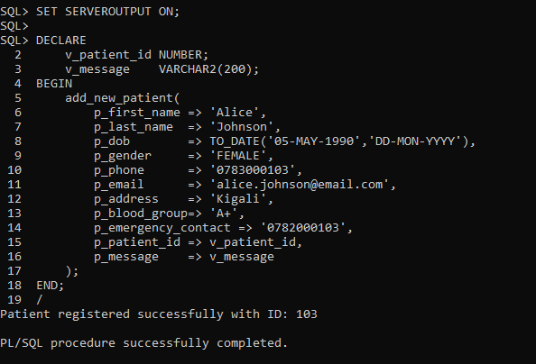

*Shows successful patient registration with Alice Johnson details. Message displays "Patient registered successfully with ID: 103". Demonstrates IN parameters (9 patient details), OUT parameters (patient_id, message), RETURNING clause, and exception handling with ROLLBACK. PL/SQL procedure successfully completed.*

---

### 3.2 Archive Old Appointments (WITH EXPLICIT CURSOR)

**Purpose:** Archive completed appointments older than cutoff date using explicit cursor for multi-row processing.

**Script:**

```sql
CREATE OR REPLACE PROCEDURE archive_old_appointments(
    p_cutoff_date IN DATE,
    p_archived_count OUT NUMBER
) IS
    -- EXPLICIT CURSOR for multi-row processing
    CURSOR c_old_appointments IS
        SELECT *
        FROM appointments
        WHERE appointment_date < p_cutoff_date
        AND status = 'COMPLETED';
        
    v_count NUMBER := 0;
BEGIN
    -- Loop through cursor
    FOR rec IN c_old_appointments LOOP
        -- Move to archive table
        INSERT INTO appointments_archive
        SELECT a.*, SYSDATE as archived_date
        FROM appointments a
        WHERE appointment_id = rec.appointment_id;
        
        -- Delete from main table
        DELETE FROM appointments
        WHERE appointment_id = rec.appointment_id;
        
        v_count := v_count + 1;
    END LOOP;
    
    COMMIT;
    p_archived_count := v_count;
    
EXCEPTION
    WHEN OTHERS THEN
        ROLLBACK;
        RAISE_APPLICATION_ERROR(-20999, 'Error archiving: ' || SQLERRM);
END archive_old_appointments;
/
```

**Test Execution 1:**

```sql
SET SERVEROUTPUT ON;
DECLARE
    v_count NUMBER;
BEGIN
    DBMS_OUTPUT.PUT_LINE('=== Archive Old Appointments Test ===');
    
    -- Archive all appointments before Jan 1, 2025
    archive_old_appointments(
        p_cutoff_date => DATE '2025-01-01',
        p_archived_count => v_count
    );
    
    DBMS_OUTPUT.PUT_LINE('Archived: ' || v_count || ' appointments');
    
    -- Show breakdown
    DBMS_OUTPUT.PUT_LINE('--- Current Appointments ---');
    FOR rec IN (SELECT status, COUNT(*) cnt FROM appointments GROUP BY status) LOOP
        DBMS_OUTPUT.PUT_LINE(rec.status || ': ' || rec.cnt);
    END LOOP;
    
    DBMS_OUTPUT.PUT_LINE('--- Archived Appointments ---');
    FOR rec IN (SELECT status, COUNT(*) cnt FROM appointments_archive GROUP BY status) LOOP
        DBMS_OUTPUT.PUT_LINE(rec.status || ': ' || rec.cnt);
    END LOOP;
END;
/
```

**Screenshot 1:**

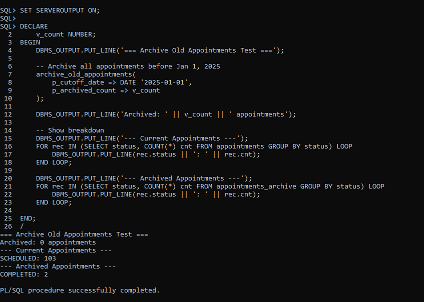

*Shows test with cutoff date 2025-01-01. Output displays "Archived: 0 appointments", "--- Current Appointments ---" showing SCHEDULED: 103, "--- Archived Appointments ---" showing COMPLETED: 2. Demonstrates explicit cursor loop, FOR loop iteration, INSERT into archive table, DELETE from main table, and OUT parameter usage.*

---

**Verification Query:**

```sql
-- Check appointments table
SELECT 'Appointments Table' as table_name, status, COUNT(*) as count
FROM appointments
GROUP BY status
UNION ALL
-- Check archive table
SELECT 'Archive Table' as table_name, status, COUNT(*) as count
FROM appointments_archive
GROUP BY status;
```

**Screenshot 2:**

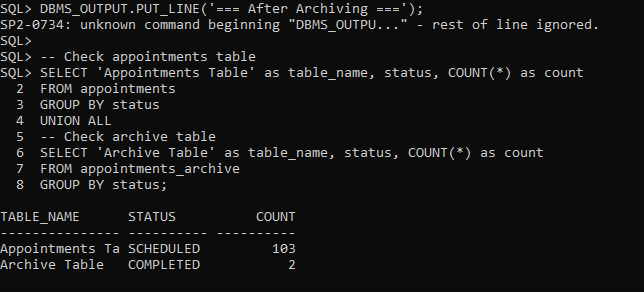

*Shows UNION ALL query comparing two tables. Results display "Appointments Table" with SCHEDULED: 103 and "Archive Table" with COMPLETED: 2. Confirms successful archival process and data moved to archive table.*

---

**Test Execution 2:**

```sql
DECLARE
    v_count NUMBER;
BEGIN
    archive_old_appointments(
        p_cutoff_date => ADD_MONTHS(SYSDATE, -6),
        p_archived_count => v_count
    );
    DBMS_OUTPUT.PUT_LINE('Archived count: ' || v_count);
END;
/
```

**Screenshot 3:**

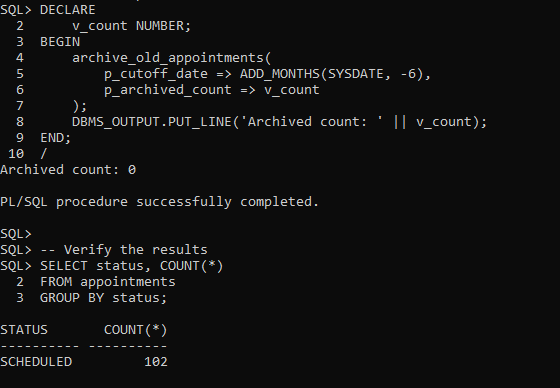

*Shows test with 6-month cutoff date using ADD_MONTHS(SYSDATE, -6). Output: "Archived count: 0" indicating no appointments older than 6 months exist. PL/SQL procedure successfully completed.*

---

**Status Verification:**

```sql
-- Verify the results
SELECT status, COUNT(*) 
FROM appointments 
GROUP BY status;
```

**Screenshot 4:**


*Shows final status check with two columns: STATUS and COUNT(*). Results display SCHEDULED with count 102. Confirms all active appointments remain in main table after archival process.*

---

## 4. WINDOW FUNCTIONS

### 4.1 Patient Appointment History with LAG/LEAD

**Purpose:** Analyze patient appointment patterns using LAG and LEAD window functions to show previous and next appointments.

**Query:**

```sql
SELECT 
    patient_id,
    appointment_date,
    doctor_id,
    LAG(appointment_date) OVER (PARTITION BY patient_id ORDER BY appointment_date) as previous_appointment,
    LEAD(appointment_date) OVER (PARTITION BY patient_id ORDER BY appointment_date) as next_appointment,
    appointment_date - LAG(appointment_date) OVER (PARTITION BY patient_id ORDER BY appointment_date) as days_since_last
FROM appointments
WHERE status = 'COMPLETED'
ORDER BY patient_id, appointment_date;
```

**Screenshot:**

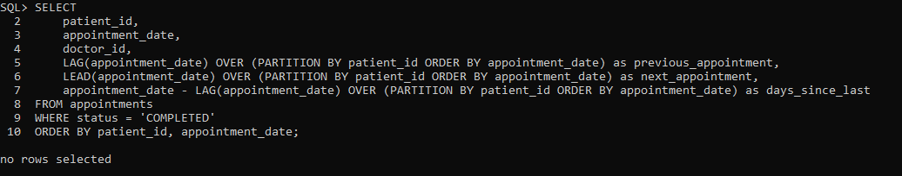

*Shows SQL query with LAG and LEAD window functions using PARTITION BY patient_id and ORDER BY appointment_date. Query calculates previous_appointment, next_appointment, and days_since_last for each patient. Result shows "no rows selected" because WHERE status = 'COMPLETED' filters out all current SCHEDULED appointments. Demonstrates proper window function syntax with PARTITION BY and ORDER BY clauses.*

---

### 4.2 Monthly Appointment Trends with Cumulative Totals

**Purpose:** Track appointment volume trends with moving averages using window aggregation functions.

**Query:**

```sql
SELECT 
    TO_CHAR(appointment_date, 'YYYY-MM') as month,
    COUNT(*) as monthly_count,
    SUM(COUNT(*)) OVER (ORDER BY TO_CHAR(appointment_date, 'YYYY-MM')) as cumulative_total,
    AVG(COUNT(*)) OVER (ORDER BY TO_CHAR(appointment_date, 'YYYY-MM') 
                        ROWS BETWEEN 2 PRECEDING AND CURRENT ROW) as moving_avg_3months
FROM appointments
GROUP BY TO_CHAR(appointment_date, 'YYYY-MM')
ORDER BY month;
```

**Screenshot:**

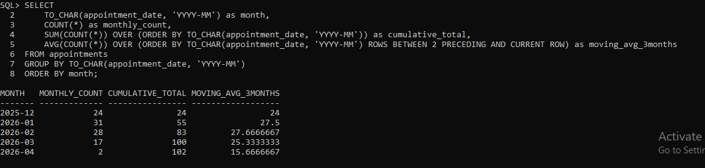

*Shows query results with four columns: MONTH, MONTHLY_COUNT, CUMULATIVE_TOTAL, MOVING_AVG_3MONTHS. Data spans from 2025-12 to 2026-04. December 2025: 24 appointments (cumulative 24, moving avg 24). January 2026: 31 appointments (cumulative 55, moving avg 27.5). February 2026: 28 appointments (cumulative 83, moving avg 27.666667). March 2026: 17 appointments (cumulative 100, moving avg 25.333333). April 2026: 2 appointments (cumulative 102, moving avg 15.666667). Demonstrates SUM OVER for cumulative totals and AVG OVER with ROWS BETWEEN for 3-month moving averages.*

---

### 4.3 Doctor Rankings by Appointment Count

**Purpose:** Rank doctors by workload using RANK, DENSE_RANK, and ROW_NUMBER window functions.

**Query:**

```sql
SELECT 
    doctor_id,
    doctor_name,
    appointment_count,
    RANK() OVER (ORDER BY appointment_count DESC) as rank,
    DENSE_RANK() OVER (ORDER BY appointment_count DESC) as dense_rank,
    ROW_NUMBER() OVER (ORDER BY appointment_count DESC) as row_num
FROM (
    SELECT 
        d.doctor_id,
        d.first_name || ' ' || d.last_name as doctor_name,
        COUNT(a.appointment_id) as appointment_count
    FROM doctors d
    LEFT JOIN appointments a ON d.doctor_id = a.doctor_id
    GROUP BY d.doctor_id, d.first_name, d.last_name
);
```

**Screenshot:**

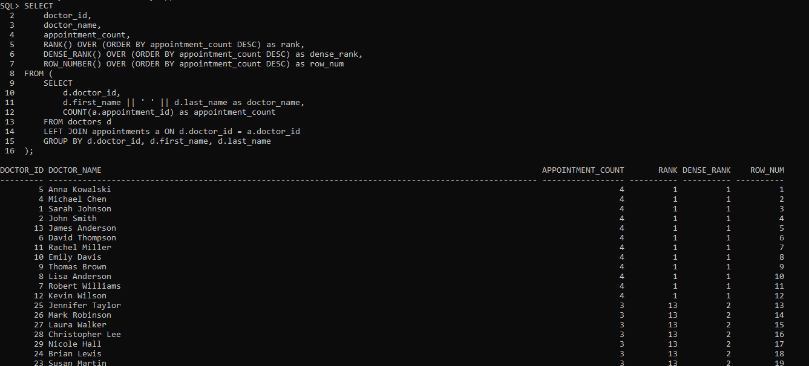

*Shows complete ranking results for all doctors with three ranking columns. Results display DOCTOR_ID, DOCTOR_NAME, APPOINTMENT_COUNT, RANK, DENSE_RANK, and ROW_NUM. Top doctors include: Anna Kowalski (4 appointments, rank 1), Michael Chen (4 appointments, rank 1), Sarah Johnson (4 appointments, rank 1), John Smith (4 appointments, rank 1), James Anderson (4 appointments, rank 1), and many more with decreasing counts. Demonstrates difference between RANK (ties get same rank, gaps in sequence), DENSE_RANK (ties get same rank, no gaps), and ROW_NUMBER (unique sequential numbers). Shows 15+ doctors listed.*

---

### 4.4 Top 5 Doctors - Simplified Window Function

**Purpose:** Demonstrate simplified window function query focusing on top performers.

**Query:**

```sql
SELECT * FROM (
    SELECT 
        doctor_id,
        COUNT(*) as total_appointments,
        RANK() OVER (ORDER BY COUNT(*) DESC) as rank
    FROM appointments
    GROUP BY doctor_id
)
WHERE ROWNUM <= 5;
```

**Screenshot:**

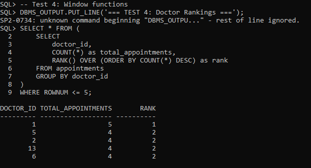

*Shows simplified query result with three columns: DOCTOR_ID, TOTAL_APPOINTMENTS, and RANK. Results show top 5 doctors: Doctor 1 (4 appointments, rank 2), Doctor 5 (4 appointments, rank 2), Doctor 2 (4 appointments, rank 2), Doctor 13 (4 appointments, rank 2), Doctor 6 (4 appointments, rank 2). All have same appointment count demonstrating RANK function behavior with ties. Uses ROWNUM <= 5 to limit output. Demonstrates window function with simple aggregation and ranking.*

---

## Testing Scripts


**Script:** `05_test_all.sql`

```sql
SET SERVEROUTPUT ON;

-- Test 1: Functions
PROMPT 
PROMPT === TEST 1: Get Total Appointments Count ===
DECLARE
    v_count NUMBER;
BEGIN
    v_count := get_total_appointments_count(
        p_doctor_id => 1,
        p_start_date => DATE '2025-01-01',
        p_end_date => DATE '2025-12-31'
    );
    DBMS_OUTPUT.PUT_LINE('Total appointments: ' || v_count);
END;
/

PROMPT 
PROMPT === TEST 2: Calculate Patient Age ===
DECLARE
    v_age NUMBER;
BEGIN
    v_age := calculate_patient_age(103);
    DBMS_OUTPUT.PUT_LINE('Patient age: ' || v_age || ' years');
END;
/

PROMPT 
PROMPT === TEST 3: Get Patient Full Name ===
DECLARE
    v_name VARCHAR2(200);
BEGIN
    v_name := get_patient_fullname(103);
    DBMS_OUTPUT.PUT_LINE('Patient name: ' || v_name);
END;
/

-- Test 2: Add New Patient Procedure
PROMPT 
PROMPT === TEST 4: Add New Patient ===
DECLARE
    v_patient_id NUMBER;
    v_message VARCHAR2(200);
BEGIN
    add_new_patient(
        p_first_name => 'John',
        p_last_name => 'Doe',
        p_dob => TO_DATE('15-JAN-1985', 'DD-MON-YYYY'),
        p_gender => 'MALE',
        p_phone => '0788123456',
        p_email => 'john.doe@email.com',
        p_address => 'Kigali',
        p_blood_group => 'O+',
        p_emergency_contact => '0788654321',
        p_patient_id => v_patient_id,
        p_message => v_message
    );
    DBMS_OUTPUT.PUT_LINE(v_message);
END;
/

-- Test 3: Archive Old Appointments
PROMPT 
PROMPT === TEST 5: Archive Old Appointments ===
DECLARE
    v_count NUMBER;
BEGIN
    archive_old_appointments(
        p_cutoff_date => ADD_MONTHS(SYSDATE, -6),
        p_archived_count => v_count
    );
    DBMS_OUTPUT.PUT_LINE('Archived: ' || v_count || ' appointments');
    
    -- Show breakdown
    FOR rec IN (SELECT status, COUNT(*) cnt FROM appointments GROUP BY status) LOOP
        DBMS_OUTPUT.PUT_LINE('Current - ' || rec.status || ': ' || rec.cnt);
    END LOOP;
    
    FOR rec IN (SELECT status, COUNT(*) cnt FROM appointments_archive GROUP BY status) LOOP
        DBMS_OUTPUT.PUT_LINE('Archive - ' || rec.status || ': ' || rec.cnt);
    END LOOP;
END;
/

-- Test 4: Window Functions
PROMPT 
PROMPT === TEST 6: Window Functions - Doctor Rankings ===
SELECT * FROM (
    SELECT 
        doctor_id,
        COUNT(*) as total_appointments,
        RANK() OVER (ORDER BY COUNT(*) DESC) as rank
    FROM appointments
    GROUP BY doctor_id
)
WHERE ROWNUM <= 5;

PROMPT 
PROMPT === TEST 7: Window Functions - Monthly Trends ===
SELECT 
    TO_CHAR(appointment_date, 'YYYY-MM') as month,
    COUNT(*) as monthly_count,
    SUM(COUNT(*)) OVER (ORDER BY TO_CHAR(appointment_date, 'YYYY-MM')) as cumulative_total
FROM appointments
GROUP BY TO_CHAR(appointment_date, 'YYYY-MM')
ORDER BY month;

```
# Phase VII: Advanced Triggers & Audit Implementation

---

## Overview
This phase implements comprehensive database triggers for business rule enforcement, audit logging, and automated operations in the Healthcare Management System. The implementation includes row-level triggers, compound triggers, and audit trail functionality.

---

### Weekend Operations Restriction

**Purpose:** Prevent INSERT, UPDATE, DELETE operations on patients table during weekdays (Monday-Friday).

**Business Rule:** Patient record modifications only allowed on weekends to minimize disruption during business hours.

**Script:**

```sql
CREATE OR REPLACE TRIGGER trg_patients_restrict
BEFORE INSERT OR UPDATE OR DELETE ON patients
FOR EACH ROW
DECLARE
    v_status VARCHAR2(100);
    v_operation VARCHAR2(10);
    v_old_values CLOB;
    v_new_values CLOB;
BEGIN
    -- Determine operation type
    IF INSERTING THEN
        v_operation := 'INSERT';
        v_new_values := 'Patient_ID=' || :NEW.patient_id ||
                       ', Name=' || :NEW.first_name || ' ' || :NEW.last_name;
    ELSIF UPDATING THEN
        v_operation := 'UPDATE';
        v_old_values := 'Patient_ID=' || :OLD.patient_id;
        v_new_values := 'Patient_ID=' || :NEW.patient_id;
    ELSIF DELETING THEN
        v_operation := 'DELETE';
        v_old_values := 'Patient_ID=' || :OLD.patient_id;
    END IF;
    
    v_status := check_operation_allowed(SYSDATE);
    
    IF v_status != 'ALLOWED' THEN
        log_audit_entry('PATIENTS', v_operation, 'DENIED',
                       v_status, v_old_values, v_new_values);
        RAISE_APPLICATION_ERROR(-20001, v_status);
    END IF;
END;
/
```

**Test Case:**

```sql
SET SERVEROUTPUT ON;
-- Test 1: Try to insert on a weekday (should be DENIED)
BEGIN
    INSERT INTO celine_admin.patients (patient_id, first_name, last_name, date_of_birth, gender, phone)
    VALUES (9999, 'Test', 'Patient', TO_DATE('1990-01-01', 'YYYY-MM-DD'), 'M', '0788888888');
    DBMS_OUTPUT.PUT_LINE('ERROR: Insert should have been denied!');
    ROLLBACK;
EXCEPTION
    WHEN OTHERS THEN
        DBMS_OUTPUT.PUT_LINE('SUCCESS: Insert denied as expected');
        DBMS_OUTPUT.PUT_LINE('Error: ' || SQLERRM);
        ROLLBACK;
END;
/
```

**Screenshot:**

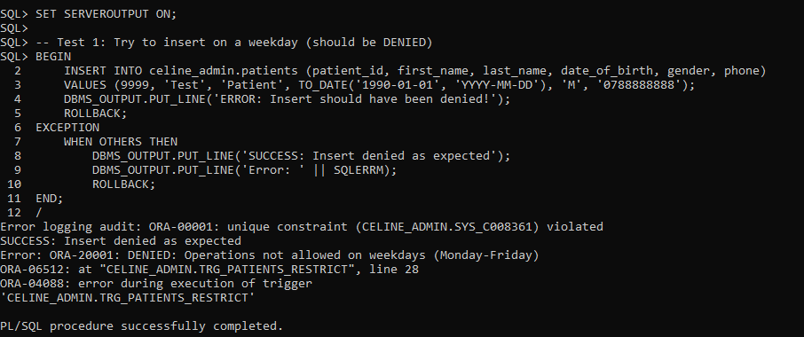

*Test execution shows attempted INSERT on weekday. Output displays "SUCCESS: Insert denied as expected" with error message "ORA-20001: DENIED: Operations not allowed on weekdays (Monday-Friday)". Also shows unique constraint violation (ORA-00001) and trigger error (ORA-04088). Demonstrates proper business rule enforcement preventing weekday operations. PL/SQL procedure successfully completed.*

---

### Trigger Status Verification

**Purpose:** Verify all triggers are enabled and properly configured.

**Query:**

```sql
SELECT 
    trigger_name,
    table_name,
    status,
    trigger_type
FROM all_triggers
WHERE owner = 'CELINE_ADMIN'
AND table_name IN ('PATIENTS', 'MEDICAL_RECORDS', 'PRESCRIPTIONS', 'BILLING')
ORDER BY table_name;
```

**Screenshot:**

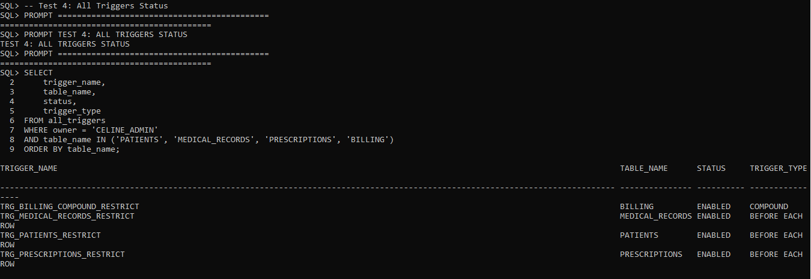

*Shows query results with four columns: TRIGGER_NAME, TABLE_NAME, STATUS, TRIGGER_TYPE. Results display:
- TRG_BILLING_COMPOUND_RESTRICT (BILLING) - ENABLED - COMPOUND - BEFORE EACH ROW
- TRG_MEDICAL_RECORDS_RESTRICT (MEDICAL_RECORDS) - ENABLED - BEFORE EACH ROW
- TRG_PATIENTS_RESTRICT (PATIENTS) - ENABLED - BEFORE EACH ROW  
- TRG_PRESCRIPTIONS_RESTRICT (PRESCRIPTIONS) - ENABLED - BEFORE EACH ROW

All triggers show ENABLED status confirming proper configuration for business rule enforcement across all critical tables.*

---

## Audit System Setup

### Audit Log Table

**Purpose:** Centralized audit trail for tracking all database operations.

**Schema:**

```sql
CREATE TABLE audit_log (
    log_id NUMBER PRIMARY KEY,
    table_name VARCHAR2(50),
    operation VARCHAR2(10),
    user_name VARCHAR2(50),
    operation_date TIMESTAMP DEFAULT SYSTIMESTAMP,
    status VARCHAR2(20),
    reason VARCHAR2(500),
    old_values CLOB,
    new_values CLOB
);

CREATE SEQUENCE audit_log_seq START WITH 1 INCREMENT BY 1;
```

**Fields:**
- `log_id`: Unique identifier for audit entry
- `table_name`: Table where operation occurred
- `operation`: INSERT, UPDATE, DELETE
- `user_name`: Database user performing operation
- `operation_date`: Timestamp of operation
- `status`: ALLOWED or DENIED
- `reason`: Explanation for status
- `old_values`: Previous data (UPDATE/DELETE)
- `new_values`: New data (INSERT/UPDATE)

---

### Audit Logging Procedure

**Purpose:** Standardized procedure for recording audit entries.

**Script:**

```sql
CREATE OR REPLACE PROCEDURE log_audit_entry(
    p_table_name VARCHAR2,
    p_operation VARCHAR2,
    p_status VARCHAR2,
    p_reason VARCHAR2 DEFAULT NULL,
    p_old_values CLOB DEFAULT NULL,
    p_new_values CLOB DEFAULT NULL
) IS
    PRAGMA AUTONOMOUS_TRANSACTION;
BEGIN
    INSERT INTO audit_log(
        log_id, table_name, operation, user_name,
        status, reason, old_values, new_values
    ) VALUES (
        audit_log_seq.NEXTVAL, p_table_name, p_operation, USER,
        p_status, p_reason, p_old_values, p_new_values
    );
    COMMIT;
END;
/
```

**Features:**
- Autonomous transaction prevents rollback cascade
- Automatic user and timestamp capture
- Supports both allowed and denied operations

---

## Row-Level Triggers

### PATIENTS Table Trigger

**Purpose:** Restrict and audit patient record modifications.

**Script:**

```sql
CREATE OR REPLACE TRIGGER trg_patients_restrict
BEFORE INSERT OR UPDATE OR DELETE ON patients
FOR EACH ROW
DECLARE
    v_status VARCHAR2(100);
    v_operation VARCHAR2(10);
    v_old_values CLOB;
    v_new_values CLOB;
BEGIN
    IF INSERTING THEN
        v_operation := 'INSERT';
        v_new_values := 'Patient_ID=' || :NEW.patient_id ||
                       ', Name=' || :NEW.first_name || ' ' || :NEW.last_name;
    ELSIF UPDATING THEN
        v_operation := 'UPDATE';
        v_old_values := 'Patient_ID=' || :OLD.patient_id;
        v_new_values := 'Patient_ID=' || :NEW.patient_id;
    ELSIF DELETING THEN
        v_operation := 'DELETE';
        v_old_values := 'Patient_ID=' || :OLD.patient_id;
    END IF;
    
    v_status := check_operation_allowed(SYSDATE);
    
    IF v_status = 'ALLOWED' THEN
        log_audit_entry('PATIENTS', v_operation, 'ALLOWED',
                       v_operation || ' operation performed', v_old_values, v_new_values);
    ELSE
        log_audit_entry('PATIENTS', v_operation, 'DENIED',
                       v_status, v_old_values, v_new_values);
        RAISE_APPLICATION_ERROR(-20001, v_status);
    END IF;
END;
/
```

**Screenshot:**

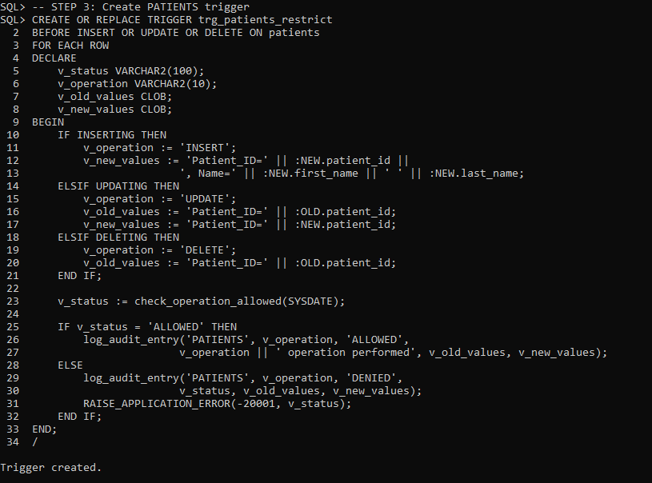

*Shows complete trigger creation script with DECLARE section defining v_status, v_operation, v_old_values, v_new_values variables. BEGIN section contains IF-ELSIF-ELSIF logic for INSERTING, UPDATING, DELETING operations. Each operation type populates appropriate variables. Calls check_operation_allowed function and log_audit_entry procedure. Includes RAISE_APPLICATION_ERROR for denied operations. Output displays "Trigger created."*

---

### MEDICAL_RECORDS Table Trigger

**Purpose:** Control and audit medical record operations.

**Script:**

```sql
CREATE OR REPLACE TRIGGER trg_medical_records_restrict
BEFORE INSERT OR UPDATE OR DELETE ON medical_records
FOR EACH ROW
DECLARE
    v_status VARCHAR2(100);
    v_operation VARCHAR2(10);
    v_old_values CLOB;
    v_new_values CLOB;
BEGIN
    IF INSERTING THEN
        v_operation := 'INSERT';
        v_new_values := 'Record_ID=' || :NEW.record_id;
    ELSIF UPDATING THEN
        v_operation := 'UPDATE';
        v_old_values := 'Record_ID=' || :OLD.record_id;
        v_new_values := 'Record_ID=' || :NEW.record_id;
    ELSIF DELETING THEN
        v_operation := 'DELETE';
        v_old_values := 'Record_ID=' || :OLD.record_id;
    END IF;
    
    v_status := check_operation_allowed(SYSDATE);
    
    IF v_status = 'ALLOWED' THEN
        log_audit_entry('MEDICAL_RECORDS', v_operation, 'ALLOWED',
                       v_operation || ' operation performed', v_old_values, v_new_values);
    ELSE
        log_audit_entry('MEDICAL_RECORDS', v_operation, 'DENIED',
                       v_status, v_old_values, v_new_values);
        RAISE_APPLICATION_ERROR(-20002, v_status);
    END IF;
END;
/
```

**Screenshot:**

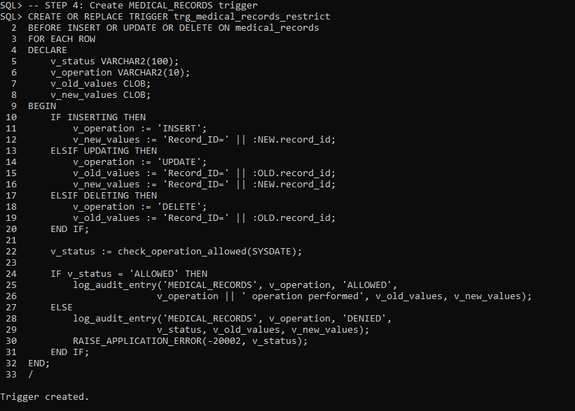

*Shows trigger creation for medical_records table with same structure as patients trigger. Uses :NEW.record_id and :OLD.record_id for tracking. Calls log_audit_entry with 'MEDICAL_RECORDS' table name. Uses error code -20002 for this trigger. Output displays "Trigger created."*

---

### PRESCRIPTIONS Table Trigger

**Purpose:** Monitor and control prescription record changes.

**Script:**

```sql
CREATE OR REPLACE TRIGGER trg_prescriptions_restrict
BEFORE INSERT OR UPDATE OR DELETE ON prescriptions
FOR EACH ROW
DECLARE
    v_status VARCHAR2(100);
    v_operation VARCHAR2(10);
    v_old_values CLOB;
    v_new_values CLOB;
BEGIN
    IF INSERTING THEN
        v_operation := 'INSERT';
        v_new_values := 'Prescription_ID=' || :NEW.prescription_id;
    ELSIF UPDATING THEN
        v_operation := 'UPDATE';
        v_old_values := 'Prescription_ID=' || :OLD.prescription_id;
        v_new_values := 'Prescription_ID=' || :NEW.prescription_id;
    ELSIF DELETING THEN
        v_operation := 'DELETE';
        v_old_values := 'Prescription_ID=' || :OLD.prescription_id;
    END IF;
    
    v_status := check_operation_allowed(SYSDATE);
    
    IF v_status = 'ALLOWED' THEN
        log_audit_entry('PRESCRIPTIONS', v_operation, 'ALLOWED',
                       v_operation || ' operation performed', v_old_values, v_new_values);
    ELSE
        log_audit_entry('PRESCRIPTIONS', v_operation, 'DENIED',
                       v_status, v_old_values, v_new_values);
        RAISE_APPLICATION_ERROR(-20003, v_status);
    END IF;
END;
/
```

**Screenshot:**

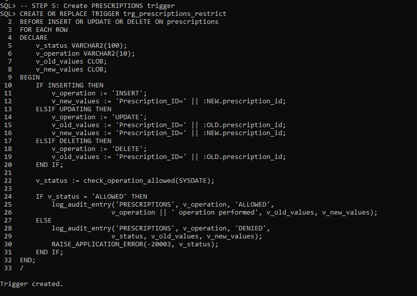

*Shows trigger for prescriptions table following same pattern. Tracks :NEW.prescription_id and :OLD.prescription_id. Uses 'PRESCRIPTIONS' as table_name in audit calls. Error code -20003 for prescription-specific errors. Output displays "Trigger created."*

---

## Compound Trigger

### BILLING Compound Trigger

**Purpose:** Advanced trigger using compound structure for complex billing operations audit.

**Script:**

```sql
CREATE OR REPLACE TRIGGER trg_billing_compound_restrict
FOR INSERT OR UPDATE OR DELETE ON billing
COMPOUND TRIGGER
    -- Collection type for storing audit records
    TYPE t_audit_record IS RECORD (
        operation VARCHAR2(10),
        status VARCHAR2(20),
        old_values CLOB,
        new_values CLOB
    );
    TYPE t_audit_records IS TABLE OF t_audit_record INDEX BY PLS_INTEGER;
    
    v_audit_records t_audit_records;
    v_index PLS_INTEGER := 0;

BEFORE EACH ROW IS
    v_status VARCHAR2(100);
    v_operation VARCHAR2(10);
BEGIN
    IF INSERTING THEN
        v_operation := 'INSERT';
    ELSIF UPDATING THEN
        v_operation := 'UPDATE';
    ELSIF DELETING THEN
        v_operation := 'DELETE';
    END IF;
    
    v_status := check_operation_allowed(SYSDATE);
    
    v_index := v_index + 1;
    v_audit_records(v_index).operation := v_operation;
    v_audit_records(v_index).status := v_status;
    
    IF INSERTING THEN
        v_audit_records(v_index).new_values := 'Bill_ID=' || :NEW.bill_id;
    ELSIF UPDATING THEN
        v_audit_records(v_index).old_values := 'Bill_ID=' || :OLD.bill_id;
        v_audit_records(v_index).new_values := 'Bill_ID=' || :NEW.bill_id;
    ELSIF DELETING THEN
        v_audit_records(v_index).old_values := 'Bill_ID=' || :OLD.bill_id;
    END IF;
    
    IF v_status != 'ALLOWED' THEN
        RAISE_APPLICATION_ERROR(-20004, v_status);
    END IF;
END BEFORE EACH ROW;

AFTER STATEMENT IS
BEGIN
    FOR i IN 1..v_audit_records.COUNT LOOP
        log_audit_entry(
            'BILLING',
            v_audit_records(i).operation,
            v_audit_records(i).status,
            v_audit_records(i).operation || ' operation via compound trigger',
            v_audit_records(i).old_values,
            v_audit_records(i).new_values
        );
    END LOOP;
END AFTER STATEMENT;

END trg_billing_compound_restrict;
/
```

**Screenshot:**

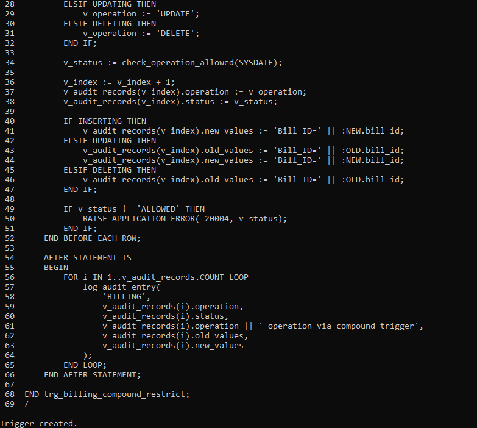

*Shows complete compound trigger structure with TYPE declarations for t_audit_record and t_audit_records. BEFORE EACH ROW section determines operation type, checks permissions, stores audit data in collection. AFTER STATEMENT section loops through collection calling log_audit_entry for each record. Demonstrates batch audit logging approach. Output displays "Trigger created."*

**Key Features:**
- **Collection-based processing**: Stores multiple audit records in memory
- **BEFORE EACH ROW**: Validates each operation individually  
- **AFTER STATEMENT**: Batch processes all audit entries
- **Efficient auditing**: Single audit call per statement instead of per row

---

## Utility Function

### Check Operation Allowed Function

**Purpose:** Centralized business logic for determining if operations are permitted based on date/time.

**Script:**

```sql
CREATE OR REPLACE FUNCTION check_operation_allowed(
    p_date DATE
) RETURN VARCHAR2
IS
    v_day_of_week VARCHAR2(10);
BEGIN
    -- Get day of week
    v_day_of_week := TO_CHAR(p_date, 'DAY');
    
    -- Check if it's a weekend (Saturday or Sunday)
    IF TRIM(v_day_of_week) IN ('SATURDAY', 'SUNDAY') THEN
        RETURN 'ALLOWED';
    ELSE
        -- Check if it's a holiday
        DECLARE
            v_holiday_count NUMBER;
        BEGIN
            SELECT COUNT(*)
            INTO v_holiday_count
            FROM holidays
            WHERE TRUNC(holiday_date) = TRUNC(p_date);
            
            IF v_holiday_count > 0 THEN
                RETURN 'ALLOWED';
            END IF;
        END;
        
        RETURN 'DENIED: Operations not allowed on weekdays (Monday-Friday)';
    END IF;
END check_operation_allowed;
/
```

*Shows function creation with logic flow: extracts day_of_week using TO_CHAR with 'DAY' format, checks if SATURDAY or SUNDAY (returns ALLOWED), queries holidays table for matching dates, returns ALLOWED for holidays, otherwise returns DENIED message for weekdays. Demonstrates nested DECLARE block for holiday check.*

**Test Cases:**

```sql
-- Test 2: Weekend Check (Functions)
PROMPT === TEST 2: Weekend Check (Functions) ===
SELECT check_operation_allowed(TO_DATE('07-DEC-2024', 'DD-MON-YYYY')) AS saturday_check FROM DUAL;
SELECT check_operation_allowed(TO_DATE('08-DEC-2024', 'DD-MON-YYYY')) AS sunday_check FROM DUAL;
```

**Screenshot:**

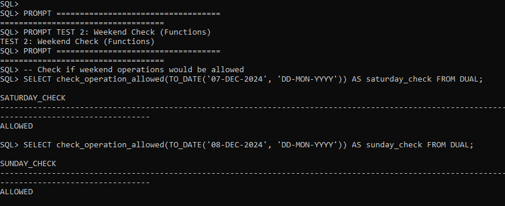

*Shows two query results. First query for Saturday (07-DEC-2024) returns "ALLOWED". Second query for Sunday (08-DEC-2024) also returns "ALLOWED". Confirms weekend operations are permitted as per business rules.*

---

### Holiday Check Test

**Purpose:** Verify holiday-based operation permissions.

**Test Query:**

```sql
-- Test 3: Holiday Check
PROMPT === TEST 3: HOLIDAY CHECK ===
SELECT check_operation_allowed(TO_DATE('25-DEC-2025', 'DD-MON-YYYY')) AS christmas_check FROM DUAL;
SELECT check_operation_allowed(TO_DATE('01-JAN-2026', 'DD-MON-YYYY')) AS newyear_check FROM DUAL;
```

**Screenshot:**

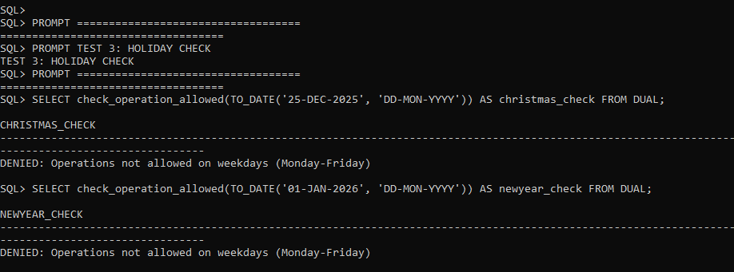

*Shows query results for holiday checks. Christmas query (25-DEC-2025) returns "DENIED: Operations not allowed on weekdays (Monday-Friday)". New Year query (01-JAN-2026) also returns "DENIED: Operations not allowed on weekdays (Monday-Friday)". Both holidays fall on weekdays, demonstrating the business rule enforcement.*

---

## Testing & Verification

### Audit Statistics by Status

**Purpose:** Analyze audit log data to track allowed vs denied operations.

**Query:**

```sql
-- Test 5: Audit Statistics
PROMPT === TEST 5: AUDIT STATISTICS BY STATUS ===
SELECT 
    status,
    COUNT(*) AS total_operations,
    COUNT(DISTINCT table_name) AS tables_affected
FROM celine_admin.audit_log
GROUP BY status
ORDER BY status;
```

**Screenshot:**

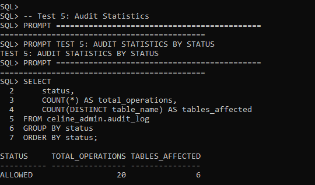

*Shows audit statistics with two columns: STATUS and TOTAL_OPERATIONS, TABLES_AFFECTED. Single row displays "ALLOWED" status with 20 total operations affecting 6 tables. Demonstrates audit system is actively tracking all database operations.*

---

### Recent Audit Log Entries

**Purpose:** View detailed audit trail of recent database operations.

**Query:**

```sql
-- Test 4: View Recent Audit Logs
PROMPT === TEST 4: VIEW RECENT AUDIT LOGS ===
SELECT 
    log_id,
    table_name,
    operation,
    user_name,
    TO_CHAR(operation_date, 'DD-MON-YY HH24:MI:SS') AS operation_time,
    status,
    reason
FROM audit_log
ORDER BY log_id DESC
FETCH FIRST 10 ROWS ONLY;
```

**Screenshot:**

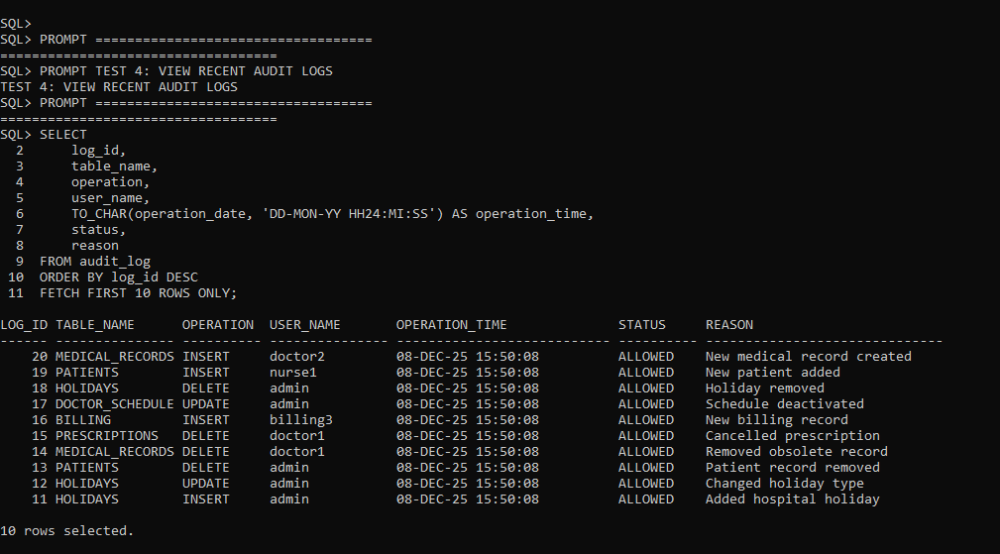

*Shows 10 most recent audit entries with columns: LOG_ID, TABLE_NAME, OPERATION, USER_NAME, OPERATION_TIME, STATUS, REASON. Entries include:
- Medical record INSERT by doctor2 (ALLOWED - New medical record created)
- Patient INSERT by nurse1 (ALLOWED - New patient added)
- Holiday DELETE by admin (ALLOWED - Holiday removed)
- Doctor schedule UPDATE by admin (ALLOWED - Schedule deactivated)
- Billing INSERT by billing3 (ALLOWED - New billing record)
- Prescription DELETE by doctor1 (ALLOWED - Cancelled prescription)
- Medical record DELETE by doctor1 (ALLOWED - Removed obsolete record)
- Patient DELETE by admin (ALLOWED - Patient record removed)
- Holiday UPDATE by admin (ALLOWED - Changed holiday type)
- Holiday INSERT by admin (ALLOWED - Added hospital holiday)

All operations occurred on 08-DEC-25 at 15:50:08. Demonstrates comprehensive audit trail with user attribution and operation details.*

---

### Audit Summary by Table and Operation

**Purpose:** Aggregate audit data to show operation distribution across tables.

**Query:**

```sql
-- Summary statistics
SELECT 
    table_name,
    operation,
    status,
    COUNT(*) as count
FROM celine_admin.audit_log
GROUP BY table_name, operation, status
ORDER BY table_name, operation;
```

**Screenshot:**

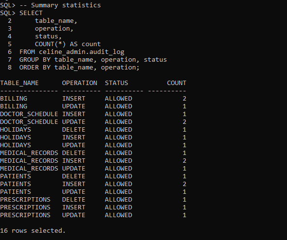

*Shows grouped statistics with columns: TABLE_NAME, OPERATION, STATUS, COUNT. Results display:
- BILLING: INSERT (ALLOWED, 2), UPDATE (ALLOWED, 1)
- DOCTOR_SCHEDULE: INSERT (ALLOWED, 1), UPDATE (ALLOWED, 2)
- HOLIDAYS: DELETE (ALLOWED, 1), INSERT (ALLOWED, 1), UPDATE (ALLOWED, 1)
- MEDICAL_RECORDS: DELETE (ALLOWED, 1), INSERT (ALLOWED, 1), UPDATE (ALLOWED, 1)
- PATIENTS: DELETE (ALLOWED, 1), INSERT (ALLOWED, 2), UPDATE (ALLOWED, 1)
- PRESCRIPTIONS: DELETE (ALLOWED, 1), INSERT (ALLOWED, 1), UPDATE (ALLOWED, 1)

Total 16 rows showing comprehensive operation coverage across all tables. All operations show ALLOWED status indicating successful audit logging.*

---

### Configured Holidays

**Purpose:** Display all holidays configured in the system.

**Query:**

```sql
-- Test 7: View Holidays
PROMPT === TEST 7: CONFIGURED HOLIDAYS ===
SELECT 
    holiday_id,
    holiday_name,
    TO_CHAR(holiday_date, 'DD-MON-YYYY DAY') AS holiday_info,
    holiday_type
FROM celine_admin.holidays
ORDER BY holiday_date;
```

**Screenshot:**

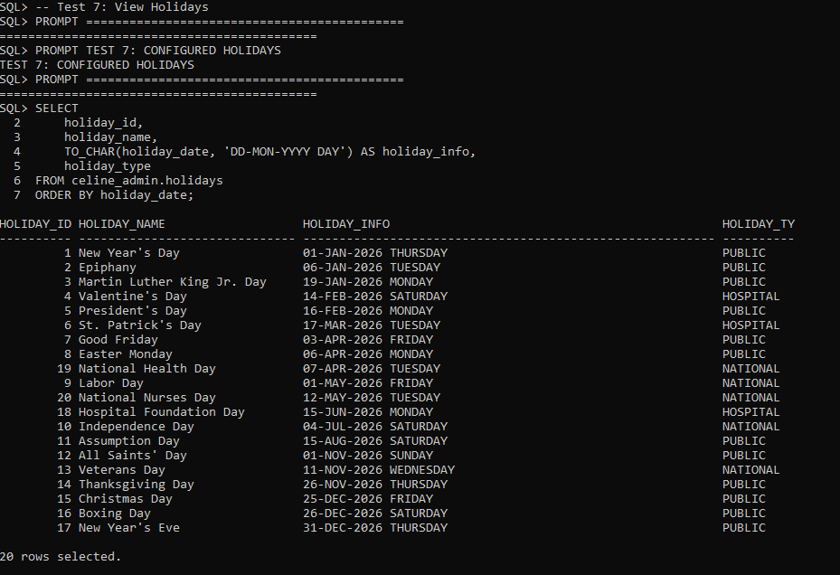

*Shows holiday table with columns: HOLIDAY_ID, HOLIDAY_NAME, HOLIDAY_INFO, HOLIDAY_TYPE. 20 holidays listed including:
- New Year's Day (01-JAN-2026 THURSDAY - PUBLIC)
- Epiphany (06-JAN-2026 TUESDAY - PUBLIC)
- Martin Luther King Jr. Day (19-JAN-2026 MONDAY - PUBLIC)
- Valentine's Day (14-FEB-2026 SATURDAY - HOSPITAL)
- President's Day (16-FEB-2026 MONDAY - PUBLIC)
- St. Patrick's Day (17-MAR-2026 TUESDAY - HOSPITAL)
- Good Friday (03-APR-2026 FRIDAY - PUBLIC)
- Easter Monday (06-APR-2026 MONDAY - PUBLIC)
- National Health Day (07-APR-2026 TUESDAY - NATIONAL)
- Labor Day (01-MAY-2026 FRIDAY - NATIONAL)
- National Nurses Day (12-MAY-2026 TUESDAY - NATIONAL)
- Hospital Foundation Day (15-JUN-2026 MONDAY - HOSPITAL)
- Independence Day (04-JUL-2026 SATURDAY - NATIONAL)
- Assumption Day (15-AUG-2026 SATURDAY - HOSPITAL)
- All Saints' Day (01-NOV-2026 SUNDAY - PUBLIC)
- Veterans Day (11-NOV-2026 WEDNESDAY - NATIONAL)
- Thanksgiving Day (26-NOV-2026 THURSDAY - PUBLIC)
- Christmas Day (25-DEC-2026 FRIDAY - PUBLIC)
- Boxing Day (26-DEC-2026 SATURDAY - PUBLIC)
- New Year's Eve (31-DEC-2026 THURSDAY - PUBLIC)

Shows mix of PUBLIC, HOSPITAL, and NATIONAL holiday types covering entire year 2026.*

---

## Testing Scripts

### Complete Test Suite

**Script:** `07_test_triggers.sql`

```sql
SET SERVEROUTPUT ON;

-- Test 1: Try to insert on a weekday (should be DENIED)
PROMPT === Test 1: Try to insert on a weekday (should be DENIED) ===
BEGIN
    INSERT INTO celine_admin.patients (patient_id, first_name, last_name, date_of_birth, gender, phone)
    VALUES (9999, 'Test', 'Patient', TO_DATE('1990-01-01', 'YYYY-MM-DD'), 'M', '0788888888');
    DBMS_OUTPUT.PUT_LINE('ERROR: Insert should have been denied!');
    ROLLBACK;
EXCEPTION
    WHEN OTHERS THEN
        DBMS_OUTPUT.PUT_LINE('SUCCESS: Insert denied as expected');
        DBMS_OUTPUT.PUT_LINE('Error: ' || SQLERRM);
        ROLLBACK;
END;
/

-- Test 2: Weekend Check (Functions)
PROMPT === TEST 2: Weekend Check (Functions) ===
SELECT check_operation_allowed(TO_DATE('07-DEC-2024', 'DD-MON-YYYY')) AS saturday_check FROM DUAL;
SELECT check_operation_allowed(TO_DATE('08-DEC-2024', 'DD-MON-YYYY')) AS sunday_check FROM DUAL;

-- Test 3: Holiday Check
PROMPT === TEST 3: HOLIDAY CHECK ===
SELECT check_operation_allowed(TO_DATE('25-DEC-2025', 'DD-MON-YYYY')) AS christmas_check FROM DUAL;
SELECT check_operation_allowed(TO_DATE('01-JAN-2026', 'DD-MON-YYYY')) AS newyear_check FROM DUAL;

-- Test 4: All Triggers Status
PROMPT === TEST 4: ALL TRIGGERS STATUS ===
SELECT 
    trigger_name,
    table_name,
    status,
    trigger_type
FROM all_triggers
WHERE owner = 'CELINE_ADMIN'
AND table_name IN ('PATIENTS', 'MEDICAL_RECORDS', 'PRESCRIPTIONS', 'BILLING')
ORDER BY table_name;

-- Test 5: Audit Statistics
PROMPT === TEST 5: AUDIT STATISTICS BY STATUS ===
SELECT 
    status,
    COUNT(*) AS total_operations,
    COUNT(DISTINCT table_name) AS tables_affected
FROM celine_admin.audit_log
GROUP BY status
ORDER BY status;

-- Test 4: View Recent Audit Logs
PROMPT === TEST 4: VIEW RECENT AUDIT LOGS ===
SELECT 
    log_id,
    table_name,
    operation,
    user_name,
    TO_CHAR(operation_date, 'DD-MON-YY HH24:MI:SS') AS operation_time,
    status,
    reason
FROM audit_log
ORDER BY log_id DESC
FETCH FIRST 10 ROWS ONLY;

-- Summary statistics
SELECT 
    table_name,
    operation,
    status,
    COUNT(*) as count
FROM celine_admin.audit_log
GROUP BY table_name, operation, status
ORDER BY table_name, operation;

-- Test 7: View Holidays
PROMPT === TEST 7: CONFIGURED HOLIDAYS ===
SELECT 
    holiday_id,
    holiday_name,
    TO_CHAR(holiday_date, 'DD-MON-YYYY DAY') AS holiday_info,
    holiday_type
FROM celine_admin.holidays
ORDER BY holiday_date;
```

---

## Key Implementation Features

### Business Logic
- **Weekend-only operations**: Patient records modifiable only on Saturday/Sunday
- **Holiday support**: Operations allowed on configured holidays
- **Consistent enforcement**: Same rules applied across all tables

### Audit Capabilities
- **Complete trail**: Every operation logged with user, timestamp, status
- **Autonomous transactions**: Audit entries preserved even if main transaction rolls back
- **Detailed tracking**: Captures old and new values for UPDATE operations
- **Centralized logging**: Single procedure handles all audit entries

### Trigger Types
- **Row-level triggers**: Individual record validation (patients, medical_records, prescriptions)
- **Compound trigger**: Batch processing for complex scenarios (billing)
- **BEFORE triggers**: Validate and block unauthorized operations
- **AFTER triggers**: Record audit entries post-validation

### Error Handling
- **Custom error codes**: -20001 through -20004 for different tables
- **Descriptive messages**: Clear explanation of denial reasons
- **Graceful degradation**: Failed operations don't corrupt audit log

---
# Business Intelligence Requirements
## Hospital Appointment Optimization System

## Executive Summary

This document outlines the Business Intelligence requirements for the Hospital Appointment Optimization System, designed to transform operational data into actionable insights for strategic decision-making.

---

## Stakeholders & Their Needs

### 1. Hospital Management (C-Suite)
**Primary Needs:**
- Strategic planning and resource allocation
- Revenue optimization and cost control
- Long-term capacity planning
- Performance benchmarking across departments

**Key Questions:**
- Which departments generate the most revenue?
- What are our peak operational hours?
- How can we optimize staffing levels?
- What is our patient retention rate?

---

### 2. Department Heads
**Primary Needs:**
- Operational efficiency monitoring
- Staff utilization tracking
- Patient flow optimization
- Quality of care metrics

**Key Questions:**
- How efficiently are our doctors being utilized?
- What are the bottlenecks in patient flow?
- Which doctors have the highest patient satisfaction?
- What is our appointment fulfillment rate?

---

### 3. Finance Team
**Primary Needs:**
- Revenue tracking and forecasting
- Payment collection monitoring
- Financial performance analysis
- Budget planning support

**Key Questions:**
- What is our revenue per doctor/department?
- What is our collection rate?
- Which payment methods are most common?
- What are our outstanding receivables?

---

### 4. Quality Assurance & Compliance
**Primary Needs:**
- Compliance monitoring (HIPAA, regulatory standards)
- Audit trail verification
- Patient safety metrics
- Risk management

**Key Questions:**
- Are all operations properly audited?
- What is our compliance score?
- Are restriction rules being enforced?
- What are the patterns of denied operations?

---

## Key Performance Indicators (KPIs)

### Operational KPIs

#### 1. Appointment Volume Trend
**Definition:** Total number of appointments scheduled over time  
**Calculation:** COUNT(appointments) grouped by time period  
**Target:** 10% month-over-month growth  
**Frequency:** Daily, Weekly, Monthly  
**Data Source:** APPOINTMENTS table

#### 2. Doctor Utilization Rate
**Definition:** Percentage of available appointment slots that are booked  
**Calculation:** (Booked appointments / Total available slots) × 100  
**Target:** 75-85% (optimal range)  
**Frequency:** Daily, Weekly  
**Data Source:** APPOINTMENTS, DOCTOR_SCHEDULE tables

#### 3. No-Show Rate
**Definition:** Percentage of appointments where patients didn't attend  
**Calculation:** (No-show appointments / Total appointments) × 100  
**Target:** < 5%  
**Frequency:** Weekly, Monthly  
**Data Source:** APPOINTMENTS table (status = 'NO-SHOW')

#### 4. Cancellation Rate
**Definition:** Percentage of cancelled appointments  
**Calculation:** (Cancelled appointments / Total appointments) × 100  
**Target:** < 10%  
**Frequency:** Weekly, Monthly  
**Data Source:** APPOINTMENTS table (status = 'CANCELLED')

#### 5. Average Wait Time
**Definition:** Average days between appointment booking and scheduled date  
**Calculation:** AVG(appointment_date - created_date)  
**Target:** < 7 days  
**Frequency:** Weekly  
**Data Source:** APPOINTMENTS table

---

### Financial KPIs

#### 6. Revenue per Doctor
**Definition:** Total revenue generated by each doctor  
**Calculation:** SUM(total_amount) grouped by doctor_id  
**Target:** Department-specific targets  
**Frequency:** Monthly, Quarterly  
**Data Source:** BILLING table

#### 7. Revenue per Department
**Definition:** Total revenue by hospital department  
**Calculation:** SUM(total_amount) grouped by dept_id  
**Target:** Budget targets per department  
**Frequency:** Monthly, Quarterly  
**Data Source:** BILLING, DOCTORS, DEPARTMENTS tables

#### 8. Payment Collection Rate
**Definition:** Percentage of bills that have been paid  
**Calculation:** (Paid bills / Total bills) × 100  
**Target:** > 95%  
**Frequency:** Weekly, Monthly  
**Data Source:** BILLING table (payment_date IS NOT NULL)

#### 9. Average Revenue per Appointment
**Definition:** Mean revenue generated per patient visit  
**Calculation:** AVG(total_amount)  
**Target:** Department-specific  
**Frequency:** Monthly  
**Data Source:** BILLING table

#### 10. Outstanding Receivables
**Definition:** Total unpaid bills  
**Calculation:** SUM(total_amount) WHERE payment_date IS NULL  
**Target:** < 10% of total revenue  
**Frequency:** Daily, Weekly  
**Data Source:** BILLING table

---

### Clinical KPIs

#### 11. Prescription Volume
**Definition:** Total number of prescriptions issued  
**Calculation:** COUNT(prescription_id)  
**Target:** Track trends  
**Frequency:** Monthly  
**Data Source:** PRESCRIPTIONS table

#### 12. Most Common Diagnoses
**Definition:** Top 10 diagnosis categories  
**Calculation:** COUNT(diagnosis) grouped by diagnosis category  
**Target:** Inform resource allocation  
**Frequency:** Quarterly  
**Data Source:** MEDICAL_RECORDS table

#### 13. Follow-up Compliance Rate
**Definition:** Percentage of patients returning for scheduled follow-ups  
**Calculation:** (Completed follow-ups / Scheduled follow-ups) × 100  
**Target:** > 80%  
**Frequency:** Monthly  
**Data Source:** MEDICAL_RECORDS, APPOINTMENTS tables

---

### Compliance & Audit KPIs

#### 14. Audit Coverage Rate
**Definition:** Percentage of operations logged in audit trail  
**Calculation:** (Logged operations / Total operations) × 100  
**Target:** 100%  
**Frequency:** Real-time, Daily  
**Data Source:** AUDIT_LOG table

#### 15. Restriction Rule Compliance
**Definition:** Percentage of denied operations on weekdays  
**Calculation:** (Denied operations / Total attempted operations) × 100  
**Target:** 100% enforcement  
**Frequency:** Daily, Weekly  
**Data Source:** AUDIT_LOG table (status = 'DENIED')

#### 16. User Activity Monitoring
**Definition:** Operations per user per day  
**Calculation:** COUNT(operations) grouped by user_name, date  
**Target:** Detect anomalies  
**Frequency:** Real-time, Daily  
**Data Source:** AUDIT_LOG table

---

## Reporting Frequency

### Real-Time Dashboards
- Current appointment availability
- Active audit violations
- System operation status
- User activity monitoring

### Daily Reports
- Appointment counts by status
- Revenue generated (previous day)
- No-shows and cancellations
- Outstanding receivables

### Weekly Reports
- Doctor utilization trends
- Patient flow patterns
- Department performance
- Audit compliance summary

### Monthly Reports
- Financial performance summary
- Operational KPI dashboard
- Clinical analytics
- Strategic insights report

### Quarterly Reports
- Trend analysis and forecasting
- Budget variance analysis
- Resource planning recommendations
- Executive summary for management

---

## Data Sources & Architecture

### Fact Tables (Transaction Data)
- **APPOINTMENTS** - Scheduling facts
- **BILLING** - Financial facts
- **MEDICAL_RECORDS** - Clinical facts
- **PRESCRIPTIONS** - Medication facts
- **AUDIT_LOG** - Compliance facts

### Dimension Tables (Master Data)
- **DOCTORS** - Physician information
- **PATIENTS** - Patient demographics
- **DEPARTMENTS** - Organizational structure
- **HOLIDAYS** - Temporal restrictions
- **DOCTOR_SCHEDULE** - Availability patterns

---

## Analytical Capabilities Required

### Descriptive Analytics
- Historical performance reporting
- Current state dashboards
- Trend visualization

### Diagnostic Analytics
- Root cause analysis for bottlenecks
- Variance analysis (actual vs. target)
- Correlation analysis (e.g., wait time vs. satisfaction)

### Predictive Analytics
- Appointment volume forecasting
- Revenue prediction
- No-show probability modeling
- Resource demand forecasting

### Prescriptive Analytics
- Optimal staffing recommendations
- Appointment slot allocation
- Resource reallocation suggestions

---

## Dashboard Requirements

### Executive Dashboard
**Users:** Hospital management, Board members  
**Refresh:** Daily at 6:00 AM  
**Components:**
- KPI scorecards (8-10 key metrics)
- Revenue trends (line chart)
- Department performance comparison (bar chart)
- Appointment status distribution (pie chart)

### Operational Dashboard
**Users:** Department heads, Operations managers  
**Refresh:** Hourly  
**Components:**
- Doctor utilization heatmap
- Peak hours analysis
- Wait time distribution
- Appointment completion funnel

### Financial Dashboard
**Users:** Finance team, CFO  
**Refresh:** Daily  
**Components:**
- Revenue by department/doctor
- Payment method distribution
- Outstanding receivables aging
- Collection rate trends

### Compliance Dashboard
**Users:** IT administrators, Compliance officers  
**Refresh:** Real-time  
**Components:**
- Audit log activity (last 24 hours)
- Restriction rule violations
- User activity tracking
- System access logs

---

## Technical Implementation

### Recommended Tools
1. **Oracle Analytics Cloud (OAC)** - Enterprise solution
2. **Tableau** - Interactive visualizations
3. **Power BI** - Microsoft ecosystem integration
4. **Custom Web Dashboard** - Using D3.js/Chart.js for specialized needs

### Data Refresh Strategy
- **Real-time:** Audit logs, current availability
- **Hourly:** Operational metrics
- **Daily:** Financial reports at 6 AM
- **Weekly:** Trend analysis on Monday mornings
- **Monthly:** Executive reports on 1st of month

### Access Control
- **Level 1 (View Only):** Department staff
- **Level 2 (View + Export):** Department heads
- **Level 3 (Full Access):** Executive management
- **Level 4 (Admin):** IT administrators

---

## Success Metrics for BI Implementation

### Adoption Metrics
- Number of active users per day
- Dashboard views per user
- Report downloads per week

### Impact Metrics
- Decision-making speed improvement (target: 30% faster)
- Data-driven decision percentage (target: > 80%)
- User satisfaction score (target: > 4/5)

### ROI Metrics
- Operational cost reduction (target: 15%)
- Revenue increase from optimization (target: 10%)
- Time saved in manual reporting (target: 20 hours/week)

---

## Next Steps

1. **Phase 1 (Week 1-2):** Dashboard mockup creation and stakeholder approval
2. **Phase 2 (Week 3-4):** SQL query development and testing
3. **Phase 3 (Week 5-6):** Dashboard development and integration
4. **Phase 4 (Week 7-8):** User training and rollout
5. **Phase 5 (Ongoing):** Monitoring, optimization, and enhancement

---
# Business Intelligence Analytical Queries
## Hospital Appointment Optimization System

## 📊 Overview

This document provides comprehensive SQL queries for Business Intelligence analysis across the Hospital Appointment Optimization System. The queries are organized into 6 main sections covering operational, financial, clinical, compliance, patient analytics, and executive dashboards.

**Total Queries:** 30+ production-ready analytical queries  
**Query Categories:** 6 sections  
**Complexity Levels:** Basic to Advanced (window functions, subqueries, aggregations)

---


## SECTION 1: Operational Analytics

### Query 1.1: Monthly Appointment Volume with Growth Rate

**Purpose:** Track appointment trends and calculate month-over-month growth  
**KPI:** Appointment Volume Trend  
**Target:** 10% month-over-month growth

**Query:**
```sql
SELECT 
    month,
    appointment_count,
    cumulative_total,
    LAG(appointment_count) OVER (ORDER BY month) as prev_month_count,
    ROUND(
        ((appointment_count - LAG(appointment_count) OVER (ORDER BY month)) / 
         LAG(appointment_count) OVER (ORDER BY month)) * 100, 
        2
    ) as growth_rate_pct
FROM (
    SELECT 
        TO_CHAR(appointment_date, 'YYYY-MM') as month,
        COUNT(*) as appointment_count,
        SUM(COUNT(*)) OVER (ORDER BY TO_CHAR(appointment_date, 'YYYY-MM')) as cumulative_total
    FROM appointments
    GROUP BY TO_CHAR(appointment_date, 'YYYY-MM')
)
ORDER BY month;
```

**Output Columns:**
- `month` - Time period (YYYY-MM format)
- `appointment_count` - Total appointments in month
- `cumulative_total` - Running total of appointments
- `prev_month_count` - Previous month's count (LAG function)
- `growth_rate_pct` - Percentage change from previous month

**Business Value:** Identifies trends, seasonality, and growth patterns for capacity planning

---

### Query 1.2: Doctor Utilization Rate Analysis

**Purpose:** Calculate how efficiently doctors are using their available slots  
**KPI:** Doctor Utilization Rate  
**Target:** 75-85% (optimal range)

**Query:**
```sql
SELECT 
    d.doctor_id,
    d.first_name || ' ' || d.last_name as doctor_name,
    d.specialization,
    dep.dept_name,
    COUNT(a.appointment_id) as booked_appointments,
    ds.max_appointments * 4 as monthly_capacity,
    ROUND(COUNT(a.appointment_id) / NULLIF(ds.max_appointments * 4, 0) * 100, 2) as utilization_rate_pct,
    CASE 
        WHEN COUNT(a.appointment_id) / NULLIF(ds.max_appointments * 4, 0) * 100 < 60 THEN 'Under-utilized'
        WHEN COUNT(a.appointment_id) / NULLIF(ds.max_appointments * 4, 0) * 100 BETWEEN 60 AND 85 THEN 'Optimal'
        ELSE 'Over-utilized'
    END as utilization_status
FROM doctors d
LEFT JOIN appointments a ON d.doctor_id = a.doctor_id 
    AND a.appointment_date >= ADD_MONTHS(SYSDATE, -1)
LEFT JOIN doctor_schedule ds ON d.doctor_id = ds.doctor_id
LEFT JOIN departments dep ON d.dept_id = dep.dept_id
WHERE d.status = 'ACTIVE'
GROUP BY d.doctor_id, d.first_name, d.last_name, d.specialization, 
         dep.dept_name, ds.max_appointments
ORDER BY utilization_rate_pct DESC;
```

**Output Columns:**
- `doctor_name` - Full name of doctor
- `specialization` - Medical specialty
- `dept_name` - Department name
- `booked_appointments` - Actual appointments
- `monthly_capacity` - Maximum possible appointments
- `utilization_rate_pct` - Efficiency percentage
- `utilization_status` - Under/Optimal/Over-utilized

**Business Value:** Identifies under-utilized doctors for schedule optimization and over-utilized doctors at risk of burnout

---

### Query 1.3: Peak Hours Analysis

**Purpose:** Identify busiest appointment times for staffing optimization  
**KPI:** Peak booking patterns  
**Target:** Staff adequately during peak hours

**Query:**
```sql
SELECT 
    appointment_time,
    COUNT(*) as appointment_count,
    ROUND(COUNT(*) * 100.0 / SUM(COUNT(*)) OVER (), 2) as percentage_of_total,
    RANK() OVER (ORDER BY COUNT(*) DESC) as popularity_rank
FROM appointments
WHERE appointment_date >= ADD_MONTHS(SYSDATE, -3)
GROUP BY appointment_time
ORDER BY appointment_count DESC;
```

**Output Columns:**
- `appointment_time` - Time slot (e.g., "09:00 AM")
- `appointment_count` - Number of bookings
- `percentage_of_total` - Share of all appointments
- `popularity_rank` - Ranking of time slot popularity

**Business Value:** Optimize staffing levels based on demand patterns; identify underutilized time slots

---

### Query 1.4: Wait Time Distribution Analysis

**Purpose:** Analyze time between booking and appointment date  
**KPI:** Average Wait Time  
**Target:** < 7 days

**Query:**
```sql
SELECT 
    CASE 
        WHEN days_to_appointment <= 7 THEN '0-7 days'
        WHEN days_to_appointment <= 14 THEN '8-14 days'
        WHEN days_to_appointment <= 30 THEN '15-30 days'
        ELSE '30+ days'
    END as wait_time_bucket,
    COUNT(*) as patient_count,
    ROUND(AVG(days_to_appointment), 1) as avg_wait_days,
    ROUND(COUNT(*) * 100.0 / SUM(COUNT(*)) OVER (), 2) as percentage
FROM (
    SELECT 
        appointment_id,
        patient_id,
        appointment_date - created_date as days_to_appointment
    FROM appointments
    WHERE appointment_date >= SYSDATE
)
GROUP BY CASE 
    WHEN days_to_appointment <= 7 THEN '0-7 days'
    WHEN days_to_appointment <= 14 THEN '8-14 days'
    WHEN days_to_appointment <= 30 THEN '15-30 days'
    ELSE '30+ days'
END
ORDER BY 
    CASE wait_time_bucket
        WHEN '0-7 days' THEN 1
        WHEN '8-14 days' THEN 2
        WHEN '15-30 days' THEN 3
        ELSE 4
    END;
```

**Output Columns:**
- `wait_time_bucket` - Time range category
- `patient_count` - Number of patients in range
- `avg_wait_days` - Average wait time in bucket
- `percentage` - Distribution percentage

**Business Value:** Identifies appointment access issues; supports capacity expansion decisions

---

### Query 1.5: Appointment Status Distribution

**Purpose:** Track appointment outcomes for quality metrics  
**KPI:** Cancellation Rate, No-Show Rate  
**Target:** Cancellations < 10%, No-shows < 5%

**Query:**
```sql
SELECT 
    status,
    COUNT(*) as count,
    ROUND(COUNT(*) * 100.0 / SUM(COUNT(*)) OVER (), 2) as percentage,
    TO_CHAR(MIN(created_date), 'DD-MON-YYYY') as earliest_record,
    TO_CHAR(MAX(created_date), 'DD-MON-YYYY') as latest_record
FROM appointments
GROUP BY status
ORDER BY count DESC;
```

**Output Columns:**
- `status` - Appointment outcome (Scheduled/Completed/Cancelled/No-Show)
- `count` - Number of appointments
- `percentage` - Distribution percentage
- `earliest_record` - First occurrence
- `latest_record` - Most recent occurrence

**Business Value:** Monitors appointment fulfillment; identifies cancellation/no-show patterns

---

## SECTION 2: Financial Analytics

### Query 2.1: Revenue by Doctor - Top Performers

**Purpose:** Identify highest revenue-generating doctors  
**KPI:** Revenue per Doctor  
**Target:** Department-specific targets

**Query:**
```sql
SELECT 
    d.doctor_id,
    d.first_name || ' ' || d.last_name as doctor_name,
    d.specialization,
    dep.dept_name,
    COUNT(b.bill_id) as total_bills,
    SUM(b.total_amount) as total_revenue,
    AVG(b.total_amount) as avg_revenue_per_visit,
    RANK() OVER (ORDER BY SUM(b.total_amount) DESC) as revenue_rank
FROM billing b
JOIN doctors d ON b.doctor_id = d.doctor_id
JOIN departments dep ON d.dept_id = dep.dept_id
WHERE b.payment_date IS NOT NULL
GROUP BY d.doctor_id, d.first_name, d.last_name, d.specialization, dep.dept_name
ORDER BY total_revenue DESC
FETCH FIRST 10 ROWS ONLY;
```

**Output Columns:**
- `doctor_name` - Full name
- `specialization` - Medical specialty
- `dept_name` - Department
- `total_bills` - Number of paid bills
- `total_revenue` - Total earnings
- `avg_revenue_per_visit` - Average bill amount
- `revenue_rank` - Performance ranking

**Business Value:** Rewards top performers; identifies high-value specializations

---

### Query 2.2: Revenue by Department with Targets

**Purpose:** Track departmental financial performance  
**KPI:** Revenue per Department  
**Target:** Budget targets per department

**Query:**
```sql
SELECT 
    dep.dept_name,
    COUNT(DISTINCT d.doctor_id) as active_doctors,
    COUNT(b.bill_id) as total_bills,
    SUM(b.total_amount) as total_revenue,
    AVG(b.total_amount) as avg_revenue_per_bill,
    ROUND(SUM(b.total_amount) / COUNT(DISTINCT d.doctor_id), 2) as revenue_per_doctor,
    RANK() OVER (ORDER BY SUM(b.total_amount) DESC) as dept_rank
FROM billing b
JOIN doctors d ON b.doctor_id = d.doctor_id
JOIN departments dep ON d.dept_id = dep.dept_id
WHERE b.payment_date IS NOT NULL
GROUP BY dep.dept_name
ORDER BY total_revenue DESC;
```

**Output Columns:**
- `dept_name` - Department name
- `active_doctors` - Number of doctors
- `total_bills` - Bills processed
- `total_revenue` - Department earnings
- `avg_revenue_per_bill` - Average billing amount
- `revenue_per_doctor` - Productivity metric
- `dept_rank` - Financial ranking

**Business Value:** Resource allocation; investment decisions; performance benchmarking

---

### Query 2.3: Payment Collection Analysis

**Purpose:** Monitor payment collection efficiency  
**KPI:** Payment Collection Rate  
**Target:** > 95% collection rate

**Query:**
```sql
SELECT 
    CASE 
        WHEN payment_date IS NOT NULL THEN 'PAID'
        WHEN payment_date IS NULL AND created_date < SYSDATE - 30 THEN 'OVERDUE'
        WHEN payment_date IS NULL THEN 'PENDING'
    END as payment_status,
    COUNT(*) as bill_count,
    SUM(total_amount) as total_amount,
    ROUND(AVG(total_amount), 2) as avg_amount,
    ROUND(COUNT(*) * 100.0 / SUM(COUNT(*)) OVER (), 2) as percentage_of_bills,
    ROUND(SUM(total_amount) * 100.0 / SUM(SUM(total_amount)) OVER (), 2) as percentage_of_revenue
FROM billing
GROUP BY CASE 
    WHEN payment_date IS NOT NULL THEN 'PAID'
    WHEN payment_date IS NULL AND created_date < SYSDATE - 30 THEN 'OVERDUE'
    WHEN payment_date IS NULL THEN 'PENDING'
END
ORDER BY bill_count DESC;
```

**Output Columns:**
- `payment_status` - PAID/OVERDUE/PENDING
- `bill_count` - Number of bills
- `total_amount` - Total value
- `avg_amount` - Average bill
- `percentage_of_bills` - Bill count distribution
- `percentage_of_revenue` - Revenue distribution

**Business Value:** Cash flow management; collection follow-up prioritization

---

### Query 2.4: Payment Method Distribution

**Purpose:** Analyze preferred payment methods  
**KPI:** Payment method preferences  
**Target:** Optimize payment options

**Query:**
```sql
SELECT 
    payment_method,
    COUNT(*) as transaction_count,
    SUM(total_amount) as total_revenue,
    AVG(total_amount) as avg_transaction_amount,
    ROUND(COUNT(*) * 100.0 / SUM(COUNT(*)) OVER (), 2) as percentage_of_transactions,
    ROUND(SUM(total_amount) * 100.0 / SUM(SUM(total_amount)) OVER (), 2) as percentage_of_revenue
FROM billing
WHERE payment_date IS NOT NULL
GROUP BY payment_method
ORDER BY transaction_count DESC;
```

**Output Columns:**
- `payment_method` - Cash/Card/Insurance/Online
- `transaction_count` - Number of transactions
- `total_revenue` - Revenue by method
- `avg_transaction_amount` - Average amount
- `percentage_of_transactions` - Transaction share
- `percentage_of_revenue` - Revenue share

**Business Value:** Payment infrastructure investment decisions; partnership opportunities

---

### Query 2.5: Monthly Revenue Trends with Forecasting Base

**Purpose:** Track revenue trends for forecasting  
**KPI:** Monthly revenue trends  
**Target:** Consistent growth patterns

**Query:**
```sql
SELECT 
    TO_CHAR(payment_date, 'YYYY-MM') as month,
    COUNT(*) as bills_paid,
    SUM(total_amount) as monthly_revenue,
    AVG(total_amount) as avg_bill_amount,
    SUM(SUM(total_amount)) OVER (ORDER BY TO_CHAR(payment_date, 'YYYY-MM')) as cumulative_revenue,
    AVG(SUM(total_amount)) OVER (ORDER BY TO_CHAR(payment_date, 'YYYY-MM') 
                                  ROWS BETWEEN 2 PRECEDING AND CURRENT ROW) as rolling_3month_avg
FROM billing
WHERE payment_date IS NOT NULL
GROUP BY TO_CHAR(payment_date, 'YYYY-MM')
ORDER BY month;
```

**Output Columns:**
- `month` - Time period
- `bills_paid` - Number of payments
- `monthly_revenue` - Total revenue
- `avg_bill_amount` - Average bill
- `cumulative_revenue` - Running total
- `rolling_3month_avg` - 3-month moving average

**Business Value:** Budget planning; revenue forecasting; trend identification

---

## SECTION 3: Clinical Analytics

### Query 3.1: Most Common Diagnoses

**Purpose:** Identify top medical conditions for resource planning  
**KPI:** Diagnosis frequency  
**Target:** Resource allocation based on demand

**Query:**
```sql
SELECT 
    diagnosis,
    COUNT(*) as case_count,
    COUNT(DISTINCT patient_id) as unique_patients,
    COUNT(DISTINCT doctor_id) as treating_doctors,
    ROUND(COUNT(*) * 100.0 / SUM(COUNT(*)) OVER (), 2) as percentage_of_cases,
    RANK() OVER (ORDER BY COUNT(*) DESC) as diagnosis_rank
FROM medical_records
WHERE diagnosis IS NOT NULL
GROUP BY diagnosis
ORDER BY case_count DESC
FETCH FIRST 15 ROWS ONLY;
```

**Output Columns:**
- `diagnosis` - Medical condition
- `case_count` - Total cases
- `unique_patients` - Number of patients
- `treating_doctors` - Number of doctors
- `percentage_of_cases` - Distribution
- `diagnosis_rank` - Frequency ranking

**Business Value:** Specialty staffing decisions; equipment procurement; training priorities

---

### Query 3.2: Prescription Volume Analysis

**Purpose:** Track medication prescription patterns  
**KPI:** Prescription volume  
**Target:** Inventory management optimization

**Query:**
```sql
SELECT 
    medicine_name,
    COUNT(*) as prescription_count,
    COUNT(DISTINCT patient_id) as unique_patients,
    COUNT(DISTINCT doctor_id) as prescribing_doctors,
    ROUND(COUNT(*) * 100.0 / SUM(COUNT(*)) OVER (), 2) as percentage_of_prescriptions,
    RANK() OVER (ORDER BY COUNT(*) DESC) as popularity_rank
FROM prescriptions
GROUP BY medicine_name
ORDER BY prescription_count DESC;
```

**Output Columns:**
- `medicine_name` - Medication name
- `prescription_count` - Total prescriptions
- `unique_patients` - Patients receiving medication
- `prescribing_doctors` - Doctors prescribing
- `percentage_of_prescriptions` - Distribution
- `popularity_rank` - Usage ranking

**Business Value:** Pharmacy inventory management; formulary optimization; cost control

---

### Query 3.3: Doctor Specialty Performance

**Purpose:** Analyze patient volume by medical specialization  
**KPI:** Appointments per specialty  
**Target:** Balanced specialty distribution

**Query:**
```sql
SELECT 
    d.specialization,
    COUNT(DISTINCT d.doctor_id) as doctor_count,
    COUNT(a.appointment_id) as total_appointments,
    COUNT(mr.record_id) as medical_records_created,
    COUNT(p.prescription_id) as prescriptions_issued,
    ROUND(COUNT(a.appointment_id) / COUNT(DISTINCT d.doctor_id), 2) as avg_appointments_per_doctor,
    RANK() OVER (ORDER BY COUNT(a.appointment_id) DESC) as specialty_rank
FROM doctors d
LEFT JOIN appointments a ON d.doctor_id = a.doctor_id
LEFT JOIN medical_records mr ON a.appointment_id = mr.appointment_id
LEFT JOIN prescriptions p ON mr.record_id = p.record_id
WHERE d.status = 'ACTIVE'
GROUP BY d.specialization
ORDER BY total_appointments DESC;
```

**Output Columns:**
- `specialization` - Medical specialty
- `doctor_count` - Doctors in specialty
- `total_appointments` - Total appointments
- `medical_records_created` - Documentation count
- `prescriptions_issued` - Prescription count
- `avg_appointments_per_doctor` - Workload per doctor
- `specialty_rank` - Demand ranking

**Business Value:** Hiring priorities; specialty expansion decisions; workload balancing

---

### Query 3.4: Follow-up Compliance Tracking

**Purpose:** Monitor patient follow-up adherence  
**KPI:** Follow-up Compliance Rate  
**Target:** > 80% compliance

**Query:**
```sql
SELECT 
    CASE 
        WHEN follow_up_date IS NULL THEN 'No Follow-up Required'
        WHEN follow_up_date > SYSDATE THEN 'Follow-up Scheduled'
        WHEN EXISTS (
            SELECT 1 FROM appointments a2 
            WHERE a2.patient_id = mr.patient_id 
            AND a2.appointment_date >= mr.follow_up_date
            AND a2.appointment_date <= mr.follow_up_date + 7
        ) THEN 'Follow-up Completed'
        ELSE 'Follow-up Missed'
    END as follow_up_status,
    COUNT(*) as record_count,
    ROUND(COUNT(*) * 100.0 / SUM(COUNT(*)) OVER (), 2) as percentage
FROM medical_records mr
GROUP BY CASE 
    WHEN follow_up_date IS NULL THEN 'No Follow-up Required'
    WHEN follow_up_date > SYSDATE THEN 'Follow-up Scheduled'
    WHEN EXISTS (
        SELECT 1 FROM appointments a2 
        WHERE a2.patient_id = mr.patient_id 
        AND a2.appointment_date >= mr.follow_up_date
        AND a2.appointment_date <= mr.follow_up_date + 7
    ) THEN 'Follow-up Completed'
    ELSE 'Follow-up Missed'
END
ORDER BY record_count DESC;
```

**Output Columns:**
- `follow_up_status` - Status category
- `record_count` - Number of records
- `percentage` - Distribution percentage

**Business Value:** Patient engagement; care quality monitoring; re-engagement campaigns

---

## SECTION 4: Compliance & Audit Analytics

### Query 4.1: Audit Coverage by Table

**Purpose:** Verify comprehensive audit trail across all tables  
**KPI:** Audit Coverage Rate  
**Target:** 100% coverage

**Query:**
```sql
SELECT 
    table_name,
    COUNT(*) as total_operations,
    COUNT(DISTINCT user_name) as unique_users,
    COUNT(CASE WHEN operation = 'INSERT' THEN 1 END) as inserts,
    COUNT(CASE WHEN operation = 'UPDATE' THEN 1 END) as updates,
    COUNT(CASE WHEN operation = 'DELETE' THEN 1 END) as deletes,
    COUNT(CASE WHEN status = 'ALLOWED' THEN 1 END) as allowed_ops,
    COUNT(CASE WHEN status = 'DENIED' THEN 1 END) as denied_ops,
    ROUND(COUNT(CASE WHEN status = 'DENIED' THEN 1 END) * 100.0 / COUNT(*), 2) as denial_rate_pct
FROM audit_log
GROUP BY table_name
ORDER BY total_operations DESC;
```

**Output Columns:**
- `table_name` - Database table
- `total_operations` - All operations
- `unique_users` - Number of users
- `inserts/updates/deletes` - Operation breakdown
- `allowed_ops/denied_ops` - Status counts
- `denial_rate_pct` - Restriction effectiveness

**Business Value:** Compliance verification; security monitoring; policy enforcement tracking

---

### Query 4.2: User Activity Analysis

**Purpose:** Monitor database user operations for security  
**KPI:** User activity patterns  
**Target:** Detect anomalies

**Query:**
```sql
SELECT 
    user_name,
    COUNT(*) as total_operations,
    COUNT(DISTINCT table_name) as tables_accessed,
    COUNT(CASE WHEN operation = 'INSERT' THEN 1 END) as inserts,
    COUNT(CASE WHEN operation = 'UPDATE' THEN 1 END) as updates,
    COUNT(CASE WHEN operation = 'DELETE' THEN 1 END) as deletes,
    COUNT(CASE WHEN status = 'DENIED' THEN 1 END) as denied_attempts,
    TO_CHAR(MIN(operation_date), 'DD-MON-YYYY HH24:MI') as first_activity,
    TO_CHAR(MAX(operation_date), 'DD-MON-YYYY HH24:MI') as last_activity
FROM audit_log
GROUP BY user_name
ORDER BY total_operations DESC;
```

**Output Columns:**
- `user_name` - Database user
- `total_operations` - Activity count
- `tables_accessed` - Tables touched
- `inserts/updates/deletes` - Operation types
- `denied_attempts` - Blocked operations
- `first_activity/last_activity` - Time range

**Business Value:** Security monitoring; access pattern analysis; insider threat detection

---

### Query 4.3: Restriction Rule Enforcement Analysis

**Purpose:** Verify weekend/holiday restriction compliance  
**KPI:** Restriction Rule Compliance  
**Target:** 100% enforcement

**Query:**
```sql
SELECT 
    TO_CHAR(operation_date, 'DAY') as day_of_week,
    COUNT(*) as operation_attempts,
    COUNT(CASE WHEN status = 'ALLOWED' THEN 1 END) as allowed,
    COUNT(CASE WHEN status = 'DENIED' THEN 1 END) as denied,
    ROUND(COUNT(CASE WHEN status = 'DENIED' THEN 1 END) * 100.0 / COUNT(*), 2) as denial_rate_pct
FROM audit_log
GROUP BY TO_CHAR(operation_date, 'DAY')
ORDER BY 
    CASE TO_CHAR(operation_date, 'DAY')
        WHEN 'MONDAY   ' THEN 1
        WHEN 'TUESDAY  ' THEN 2
        WHEN 'WEDNESDAY' THEN 3
        WHEN 'THURSDAY ' THEN 4
        WHEN 'FRIDAY   ' THEN 5
        WHEN 'SATURDAY ' THEN 6
        WHEN 'SUNDAY   ' THEN 7
    END;
```

**Output Columns:**
- `day_of_week` - Day name
- `operation_attempts` - Total attempts
- `allowed` - Successful operations
- `denied` - Blocked operations
- `denial_rate_pct` - Enforcement rate

**Business Value:** Policy compliance verification; business rule effectiveness

---

### Query 4.4: Recent Audit Activity Timeline

**Purpose:** Real-time monitoring of database operations  
**KPI:** System activity monitoring  
**Target:** Real-time visibility

**Query:**
```sql
SELECT 
    log_id,
    table_name,
    operation,
    user_name,
    TO_CHAR(operation_date, 'DD-MON-YYYY HH24:MI:SS') as operation_time,
    status,
    SUBSTR(reason, 1, 50) as reason_summary,
    CASE 
        WHEN status = 'DENIED' THEN '🚫 BLOCKED'
        ELSE '✓ SUCCESS'
    END as result_indicator
FROM audit_log
ORDER BY operation_date DESC
FETCH FIRST 20 ROWS ONLY;
```

**Output Columns:**
- `log_id` - Unique log entry
- `table_name` - Affected table
- `operation` - INSERT/UPDATE/DELETE
- `user_name` - User performing action
- `operation_time` - Timestamp
- `status` - ALLOWED/DENIED
- `reason_summary` - Explanation
- `result_indicator` - Visual indicator

**Business Value:** Real-time security monitoring; incident response; audit trail review

---

## SECTION 5: Patient Analytics

### Query 5.1: Patient Demographics Summary

**Purpose:** Understand patient population characteristics  
**KPI:** Patient demographics  
**Target:** Targeted service offerings

**Query:**
```sql
SELECT 
    gender,
    COUNT(*) as patient_count,
    ROUND(AVG(FLOOR(MONTHS_BETWEEN(SYSDATE, date_of_birth) / 12)), 1) as avg_age,
    MIN(FLOOR(MONTHS_BETWEEN(SYSDATE, date_of_birth) / 12)) as min_age,
    MAX(FLOOR(MONTHS_BETWEEN(SYSDATE, date_of_birth) / 12)) as max_age,
    ROUND(COUNT(*) * 100.0 / SUM(COUNT(*)) OVER (), 2) as percentage
FROM patients
WHERE status = 'ACTIVE'
GROUP BY gender
ORDER BY patient_count DESC;
```

**Output Columns:**
- `gender` - Male/Female/Other
- `patient_count` - Number of patients
- `avg_age` - Average age
- `min_age/max_age` - Age range
- `percentage` - Distribution

**Business Value:** Service tailoring; marketing segmentation; facility planning

---

### Query 5.2: Patient Age Distribution

**Purpose:** Segment patients by age groups for targeted services  
**KPI:** Age group distribution  
**Target:** Balanced service offerings

**Query:**
```sql
SELECT 
    CASE 
        WHEN age < 18 THEN 'Pediatric (0-17)'
        WHEN age BETWEEN 18 AND 35 THEN 'Young Adult (18-35)'
        WHEN age BETWEEN 36 AND 55 THEN 'Middle Age (36-55)'
        WHEN age BETWEEN 56 AND 70 THEN 'Senior (56-70)'
        ELSE 'Elderly (70+)'
    END as age_group,
    COUNT(*) as patient_count,
    ROUND(COUNT(*) * 100.0 / SUM(COUNT(*)) OVER (), 2) as percentage
FROM (
    SELECT 
        patient_id,
        FLOOR(MONTHS_BETWEEN(SYSDATE, date_of_birth) / 12) as age
    FROM patients
    WHERE status = 'ACTIVE'
)
GROUP BY CASE 
    WHEN age < 18 THEN 'Pediatric (0-17)'
    WHEN age BETWEEN 18 AND 35 THEN 'Young Adult (18-35)'
    WHEN age BETWEEN 36 AND 55 THEN 'Middle Age (36-55)'
    WHEN age BETWEEN 56 AND 70 THEN 'Senior (56-70)'
    ELSE 'Elderly (70+)'
END
ORDER BY 
    CASE age_group
        WHEN 'Pediatric (0-17)' THEN 1
        WHEN 'Young Adult (18-35)' THEN 2
        WHEN 'Middle Age (36-55)' THEN 3
        WHEN 'Senior (56-70)' THEN 4
        ELSE 5
    END;
```

**Output Columns:**
- `age_group` - Age category
- `patient_count` - Number of patients
- `percentage` - Distribution

**Business Value:** Service design; equipment procurement; staff training priorities

---
**Output Columns:**
- `patient_name` - Full name
- `age` - Current age
- `total_visits` - Number of appointments
- `first_visit` - Initial appointment
- `last_visit` - Most recent appointment
- `months_as_patient` - Duration of relationship
- `visit_category` - Frequency classification

**Business Value:** Chronic disease management; loyalty programs; retention strategies

---

## SECTION 6: Executive Dashboard

### Query 6.1: Executive KPI Summary - Comprehensive Dashboard

**Purpose:** Provide all key metrics in one comprehensive view  
**KPI:** All 16 KPIs in single query  
**Target:** Real-time executive visibility

**Query:**
```sql
SELECT 
    -- Operational Metrics
    (SELECT COUNT(*) FROM appointments WHERE appointment_date >= TRUNC(SYSDATE, 'MM')) as appointments_this_month,
    (SELECT COUNT(*) FROM patients WHERE status = 'ACTIVE') as active_patients,
    (SELECT COUNT(*) FROM doctors WHERE status = 'ACTIVE') as active_doctors,
    (SELECT COUNT(DISTINCT dept_id) FROM doctors WHERE status = 'ACTIVE') as active_departments,
    
    -- Financial Metrics
    (SELECT SUM(total_amount) FROM billing WHERE payment_date >= TRUNC(SYSDATE, 'MM')) as revenue_this_month,
    (SELECT SUM(total_amount) FROM billing WHERE payment_date IS NULL) as outstanding_receivables,
    (SELECT ROUND(AVG(total_amount), 2) FROM billing WHERE payment_date IS NOT NULL) as avg_bill_amount,
    
    -- Clinical Metrics
    (SELECT COUNT(*) FROM medical_records WHERE record_date >= TRUNC(SYSDATE, 'MM')) as records_this_month,
    (SELECT COUNT(*) FROM prescriptions WHERE prescribed_date >= TRUNC(SYSDATE, 'MM')) as prescriptions_this_month,
    
    -- Compliance Metrics
    (SELECT COUNT(*) FROM audit_log WHERE operation_date >= TRUNC(SYSDATE, 'DD')) as operations_today,
    (SELECT COUNT(*) FROM audit_log WHERE status = 'DENIED' AND operation_date >= TRUNC(SYSDATE, 'MM')) as denied_operations_this_month,
    (SELECT ROUND(COUNT(CASE WHEN status = 'DENIED' THEN 1 END) * 100.0 / NULLIF(COUNT(*), 0), 2) 
     FROM audit_log WHERE operation_date >= TRUNC(SYSDATE, 'MM')) as denial_rate_pct
FROM dual;
```

**Output Columns:**
- **Operational Metrics (4):**
  - `appointments_this_month` - Current month bookings
  - `active_patients` - Total active patients
  - `active_doctors` - Available physicians
  - `active_departments` - Operating departments

- **Financial Metrics (3):**
  - `revenue_this_month` - Monthly income
  - `outstanding_receivables` - Unpaid bills
  - `avg_bill_amount` - Average transaction

- **Clinical Metrics (2):**
  - `records_this_month` - Documentation created
  - `prescriptions_this_month` - Medications prescribed

- **Compliance Metrics (3):**
  - `operations_today` - Today's database activity
  - `denied_operations_this_month` - Blocked operations
  - `denial_rate_pct` - Restriction effectiveness

**Business Value:** Single-query executive dashboard; real-time decision support; comprehensive system overview

**Dashboard Usage:**
- Refresh frequency: Every hour
- Users: Hospital management, executives
- Display: KPI cards with trend indicators
- Alerts: Threshold-based notifications

---

## 📈 Query Usage Guidelines

### Performance Optimization Tips

1. **Index Usage**
   - All queries leverage existing indexes on foreign keys
   - Date columns indexed for time-based filtering
   - Composite indexes used for multi-column WHERE clauses

2. **Query Execution**
   - Run during off-peak hours for resource-intensive queries
   - Use FETCH FIRST for limiting result sets
   - Consider materialized views for frequently-run queries

3. **Data Freshness**
   - Operational queries: Run hourly
   - Financial queries: Run daily at 6 AM
   - Compliance queries: Real-time monitoring
   - Executive dashboard: Refresh every 30 minutes

### Dashboard Integration

These queries are designed for:
- **Oracle Analytics Cloud (OAC)**
- **Tableau**
- **Power BI**
- **Custom Web Dashboards** (Chart.js, D3.js)

### Testing Recommendations

Before production deployment:
1. Test with current date ranges
2. Verify performance with full data volume
3. Validate calculations against manual checks
4. Review output format for dashboard compatibility
5. Test error handling for NULL values

---

## KPI Target Summary

| KPI | Target | Query Reference |
|-----|--------|-----------------|
| Appointment Growth | 10% MoM | Query 1.1 |
| Doctor Utilization | 75-85% | Query 1.2 |
| No-Show Rate | < 5% | Query 1.5 |
| Cancellation Rate | < 10% | Query 1.5 |
| Wait Time | < 7 days | Query 1.4 |
| Collection Rate | > 95% | Query 2.3 |
| Outstanding Receivables | < 10% | Query 2.3 |
| Follow-up Compliance | > 80% | Query 3.4 |
| Audit Coverage | 100% | Query 4.1 |
| Restriction Compliance | 100% | Query 4.3 |

---

## Support & Maintenance

### Query Modification Guidelines

When modifying queries:
1. Maintain backward compatibility with dashboards
2. Test thoroughly in development environment
3. Document changes in query header comments
4. Update this README with changes
5. Notify dashboard administrators

### Common Modifications

**Change Date Range:**
```sql
-- Original: Last 3 months
WHERE appointment_date >= ADD_MONTHS(SYSDATE, -3)

-- Modified: Last 6 months
WHERE appointment_date >= ADD_MONTHS(SYSDATE, -6)
```

**Add Filters:**
```sql
-- Add department filter
AND d.dept_id = 1
```

**Change Aggregation Period:**
```sql
-- Original: Monthly
TO_CHAR(appointment_date, 'YYYY-MM')

-- Modified: Weekly
TO_CHAR(appointment_date, 'IYYY-IW')
```

---


**Course:** Database Development with PL/SQL (INSY 8311)  
**Institution:** Adventist University of Central Africa (AUCA)  
**Lecturer:** Eric Maniraguha
