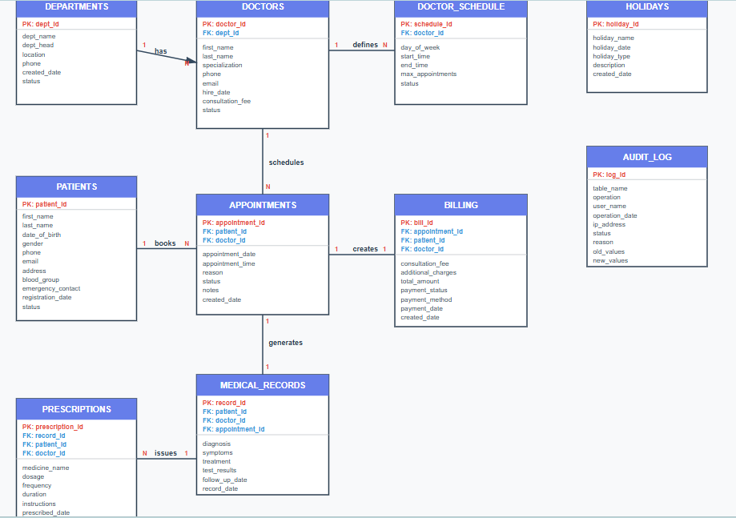
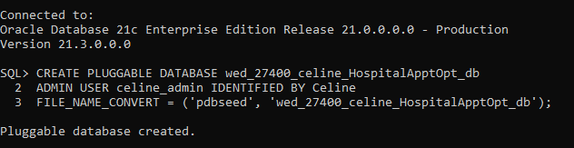
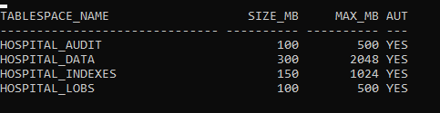
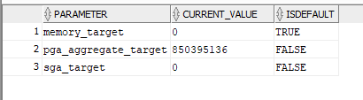
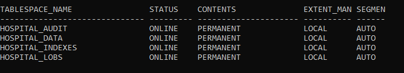
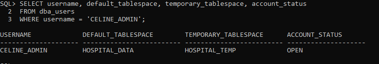

**Name:** Umukamisha Celine  
**ID:** 27400 
## Hospital Appointment Optimization System


---

##  BPMN Diagram


*Business Process Flow showing the complete appointment scheduling workflow across six swimlanes*

---

##  Scope Definition

**Business Process:** Hospital appointment scheduling and patient management workflow from booking to medical record creation.

**MIS Relevance:** Healthcare Management Information System for resource optimization, patient flow management, and regulatory compliance through automated processes and audit trails.

**Objectives:**
- Eliminate double-booking through real-time validation
- Reduce wait times
- Automate restriction checks (holidays/weekends)
- Maintain audit trails
- Integrate all hospital departments

**Expected Outcomes:** 30% reduction in scheduling errors, improved patient satisfaction, complete activity traceability.

---

##  Key Entities & Roles

| Entity | Role |
|--------|------|
| **Patient** | Initiates appointment requests, receives confirmations |
| **Receptionist** | Processes requests, queries database availability, suggests alternatives, confirms bookings |
| **System** | Validates schedules, checks holiday/restriction compliance, creates appointments, logs all activities |
| **Doctor** | Provides medical consultations |
| **Billing** | Generates bills, processes payments |
| **Medical Records** | Creates and maintains patient records |

---

##  Swimlane Structure

Six distinct swimlanes separate human actors (Patient, Receptionist, Doctor) from automated processes (System) and supporting departments (Billing, Medical Records). Clear handoff points shown where responsibility transfers between actors, ensuring accountability at each stage.

---

##  UML/BPMN Compliance

- **Start/End Events:** Green circles marking process boundaries
- **Process Activities:** Blue rounded rectangles for human tasks, purple for system automation
- **Decision Points:** Orange diamonds with YES/NO branches for conditional logic
- **Data Flow:** Black arrows showing sequential progression and dependencies
- **Logical Flow:** Clear start-to-end progression with proper branching for unavailable slots

---

##  MIS Functions

**Real-time Operations:**
- Instant schedule validation
- Automated restriction enforcement

**Data Integration:**
- Cross-department coordination (reception, doctors, billing, records)

**Compliance:**
- Automated holiday/weekend blocking per Phase VII requirements

**Audit & Security:**
- Complete activity logging for accountability and compliance

---

##  Analytics Opportunities

### Operational Intelligence
- Appointment volume trends
- Peak booking times
- Doctor utilization rates
- No-show patterns
- Average wait times

### Strategic Insights
- Resource allocation optimization
- Revenue per appointment type
- Seasonal demand forecasting
- Capacity planning

### Decision Support
- Identify bottlenecks
- Optimize staffing schedules
- Improve patient experience through data-driven decisions

---

##  Organizational Impact

This MIS transforms appointment management from manual, error-prone processes to automated, traceable workflows. It reduces administrative burden, improves resource utilization, enhances patient satisfaction, and provides hospital management with real-time operational visibility for strategic decision-making.

---

##  Entity-Relationship Diagram



*[Place your ER diagram image file in the same folder as this document and name it `er_diagram.png`]*

---

##  Entities Identified

The Healthcare Management System consists of **10 core entities**:

1. **DEPARTMENTS** - Hospital organizational units
2. **DOCTORS** - Medical practitioners
3. **PATIENTS** - Healthcare service recipients
4. **APPOINTMENTS** - Scheduled patient-doctor meetings
5. **DOCTOR_SCHEDULE** - Doctor availability patterns
6. **MEDICAL_RECORDS** - Clinical documentation
7. **PRESCRIPTIONS** - Medication orders
8. **BILLING** - Financial transactions
9. **HOLIDAYS** - Non-working days calendar
10. **AUDIT_LOG** - System activity tracking

---

##  Data Dictionary

###  DEPARTMENTS

| Column | Data Type | Constraints | Purpose |
|--------|-----------|-------------|---------|
| dept_id | NUMBER(10) | PK, NOT NULL | Unique department identifier |
| dept_name | VARCHAR2(100) | NOT NULL, UNIQUE | Department name |
| dept_head | VARCHAR2(100) | NULL | Head of department |
| location | VARCHAR2(200) | NULL | Physical location within hospital |
| phone | VARCHAR2(20) | NULL | Department contact number |
| created_date | DATE | DEFAULT SYSDATE | Record creation timestamp |
| status | VARCHAR2(20) | CHECK IN ('Active','Inactive') | Operational status |

**Indexes:** Primary key index on `dept_id`, Unique index on `dept_name`

---

### DOCTORS

| Column | Data Type | Constraints | Purpose |
|--------|-----------|-------------|---------|
| doctor_id | NUMBER(10) | PK, NOT NULL | Unique doctor identifier |
| dept_id | NUMBER(10) | FK → DEPARTMENTS(dept_id), NOT NULL | Department assignment |
| first_name | VARCHAR2(50) | NOT NULL | Doctor's first name |
| last_name | VARCHAR2(50) | NOT NULL | Doctor's last name |
| specialization | VARCHAR2(100) | NOT NULL | Medical specialization area |
| phone | VARCHAR2(20) | UNIQUE | Contact phone number |
| email | VARCHAR2(100) | UNIQUE | Email address |
| hire_date | DATE | NOT NULL | Employment start date |
| consultation_fee | NUMBER(10,2) | CHECK > 0 | Standard consultation charge |
| status | VARCHAR2(20) | CHECK IN ('Active','Inactive','On Leave') | Current availability status |

**Indexes:** Primary key on `doctor_id`, Foreign key on `dept_id`, Unique on `email`, Unique on `phone`

---

### PATIENTS

| Column | Data Type | Constraints | Purpose |
|--------|-----------|-------------|---------|
| patient_id | NUMBER(10) | PK, NOT NULL | Unique patient identifier |
| first_name | VARCHAR2(50) | NOT NULL | Patient's first name |
| last_name | VARCHAR2(50) | NOT NULL | Patient's last name |
| date_of_birth | DATE | NOT NULL | Birth date for age calculation |
| gender | VARCHAR2(10) | CHECK IN ('Male','Female','Other') | Gender identity |
| phone | VARCHAR2(20) | NOT NULL | Primary contact number |
| email | VARCHAR2(100) | NULL | Email address |
| address | VARCHAR2(200) | NULL | Residential address |
| blood_group | VARCHAR2(5) | NULL | Blood type (A+, B-, O+, etc.) |
| emergency_contact | VARCHAR2(100) | NULL | Emergency contact person details |
| registration_date | DATE | DEFAULT SYSDATE | Patient registration date |
| status | VARCHAR2(20) | CHECK IN ('Active','Inactive') | Patient account status |

**Indexes:** Primary key on `patient_id`, Index on `phone`, Index on `last_name`

---

### APPOINTMENTS

| Column | Data Type | Constraints | Purpose |
|--------|-----------|-------------|---------|
| appointment_id | NUMBER(10) | PK, NOT NULL | Unique appointment identifier |
| patient_id | NUMBER(10) | FK → PATIENTS(patient_id), NOT NULL | Patient booking appointment |
| doctor_id | NUMBER(10) | FK → DOCTORS(doctor_id), NOT NULL | Doctor assigned to appointment |
| appointment_date | DATE | NOT NULL | Date of appointment |
| appointment_time | VARCHAR2(10) | NOT NULL | Time slot (e.g., "09:00 AM") |
| reason | VARCHAR2(500) | NULL | Chief complaint/reason for visit |
| status | VARCHAR2(20) | CHECK IN ('Scheduled','Completed','Cancelled','No-Show') | Appointment status |
| created_date | DATE | DEFAULT SYSDATE | Booking creation timestamp |

**Indexes:** Primary key on `appointment_id`, Foreign keys on `patient_id` and `doctor_id`, Composite index on `(doctor_id, appointment_date)`

---

### DOCTOR_SCHEDULE

| Column | Data Type | Constraints | Purpose |
|--------|-----------|-------------|---------|
| schedule_id | NUMBER(10) | PK, NOT NULL | Unique schedule identifier |
| doctor_id | NUMBER(10) | FK → DOCTORS(doctor_id), NOT NULL | Doctor this schedule applies to |
| day_of_week | VARCHAR2(15) | NOT NULL | Day name (Monday-Sunday) |
| start_time | VARCHAR2(10) | NOT NULL | Shift start time (e.g., "08:00 AM") |
| end_time | VARCHAR2(10) | NOT NULL | Shift end time (e.g., "05:00 PM") |
| max_appointments | NUMBER(3) | CHECK > 0 | Maximum patient slots per day |
| status | VARCHAR2(20) | CHECK IN ('Active','Inactive') | Schedule validity status |

**Indexes:** Primary key on `schedule_id`, Foreign key on `doctor_id`, Composite index on `(doctor_id, day_of_week)`

---

### MEDICAL_RECORDS

| Column | Data Type | Constraints | Purpose |
|--------|-----------|-------------|---------|
| record_id | NUMBER(10) | PK, NOT NULL | Unique medical record identifier |
| patient_id | NUMBER(10) | FK → PATIENTS(patient_id), NOT NULL | Patient this record belongs to |
| doctor_id | NUMBER(10) | FK → DOCTORS(doctor_id), NOT NULL | Doctor who created record |
| appointment_id | NUMBER(10) | FK → APPOINTMENTS(appointment_id), NOT NULL | Associated appointment |
| diagnosis | VARCHAR2(1000) | NULL | Medical diagnosis details |
| symptoms | VARCHAR2(1000) | NULL | Patient-reported symptoms |
| treatment | VARCHAR2(1000) | NULL | Treatment plan prescribed |
| notes | VARCHAR2(2000) | NULL | Additional clinical notes |
| follow_up_date | DATE | NULL | Recommended next visit date |
| record_date | DATE | DEFAULT SYSDATE | Record creation date |

**Indexes:** Primary key on `record_id`, Foreign keys on `patient_id`, `doctor_id`, `appointment_id`

---

### PRESCRIPTIONS

| Column | Data Type | Constraints | Purpose |
|--------|-----------|-------------|---------|
| prescription_id | NUMBER(10) | PK, NOT NULL | Unique prescription identifier |
| record_id | NUMBER(10) | FK → MEDICAL_RECORDS(record_id), NOT NULL | Parent medical record |
| patient_id | NUMBER(10) | FK → PATIENTS(patient_id), NOT NULL | Patient receiving prescription |
| doctor_id | NUMBER(10) | FK → DOCTORS(doctor_id), NOT NULL | Prescribing doctor |
| medicine_name | VARCHAR2(200) | NOT NULL | Medication/drug name |
| dosage | VARCHAR2(100) | NOT NULL | Dosage amount (e.g., "500mg") |
| frequency | VARCHAR2(100) | NOT NULL | Intake frequency (e.g., "Twice daily") |
| duration | VARCHAR2(50) | NOT NULL | Treatment duration (e.g., "7 days") |
| instructions | VARCHAR2(500) | NULL | Special instructions (e.g., "Take with food") |
| prescribed_date | DATE | DEFAULT SYSDATE | Prescription issue date |

**Indexes:** Primary key on `prescription_id`, Foreign keys on `record_id`, `patient_id`, `doctor_id`

---

### BILLING

| Column | Data Type | Constraints | Purpose |
|--------|-----------|-------------|---------|
| bill_id | NUMBER(10) | PK, NOT NULL | Unique billing identifier |
| appointment_id | NUMBER(10) | FK → APPOINTMENTS(appointment_id), NOT NULL | Associated appointment |
| patient_id | NUMBER(10) | FK → PATIENTS(patient_id), NOT NULL | Patient being billed |
| doctor_id | NUMBER(10) | FK → DOCTORS(doctor_id), NOT NULL | Doctor who provided service |
| consultation_fee | NUMBER(10,2) | NOT NULL | Doctor consultation charge |
| additional_charges | NUMBER(10,2) | DEFAULT 0 | Tests/procedures/lab charges |
| total_amount | NUMBER(10,2) | NOT NULL | Total bill amount |
| discount | NUMBER(5,2) | DEFAULT 0 | Discount percentage applied |
| payment_method | VARCHAR2(50) | CHECK IN ('Cash','Card','Insurance','Online') | Payment mode |
| payment_date | DATE | NULL | Actual payment date (NULL if unpaid) |
| created_date | DATE | DEFAULT SYSDATE | Bill generation date |

**Indexes:** Primary key on `bill_id`, Foreign keys on `appointment_id`, `patient_id`, `doctor_id`

---

### HOLIDAYS

| Column | Data Type | Constraints | Purpose |
|--------|-----------|-------------|---------|
| holiday_id | NUMBER(10) | PK, NOT NULL | Unique holiday identifier |
| holiday_name | VARCHAR2(100) | NOT NULL | Holiday name (e.g., "Christmas") |
| holiday_date | DATE | NOT NULL, UNIQUE | Exact holiday date |
| location | VARCHAR2(100) | NULL | Geographic scope (if regional) |
| holiday_type | VARCHAR2(50) | CHECK IN ('Public','Medical','Custom') | Holiday category |
| created_date | DATE | DEFAULT SYSDATE | Record creation timestamp |

**Indexes:** Primary key on `holiday_id`, Unique index on `holiday_date`

---

### AUDIT_LOG

| Column | Data Type | Constraints | Purpose |
|--------|-----------|-------------|---------|
| log_id | NUMBER(10) | PK, NOT NULL | Unique audit log identifier |
| table_name | VARCHAR2(50) | NOT NULL | Table where operation attempted |
| operation | VARCHAR2(20) | CHECK IN ('INSERT','UPDATE','DELETE') | DML operation type |
| user_name | VARCHAR2(50) | NOT NULL | Database user performing operation |
| operation_date | TIMESTAMP | DEFAULT SYSTIMESTAMP | Exact operation timestamp |
| ip_address | VARCHAR2(50) | NULL | User's IP address |
| status | VARCHAR2(20) | CHECK IN ('ALLOWED','DENIED') | Operation result |
| reason | VARCHAR2(200) | NULL | Reason for denial (if blocked) |
| old_values | CLOB | NULL | Previous data state (for UPDATE/DELETE) |
| new_values | CLOB | NULL | New data state (for INSERT/UPDATE) |

**Indexes:** Primary key on `log_id`, Index on `operation_date`, Index on `table_name`

---

### Normalization Analysis

### 4.1 First Normal Form (1NF)
 **Achieved** - All tables satisfy 1NF:
- Every column contains atomic (indivisible) values
- No repeating groups or arrays
- Each row is unique (identified by primary key)
- Column names are unique within each table

**Example:** Patient contact information is stored atomically (separate fields for phone, email, address) rather than in a single "contact_info" field.

---

### Second Normal Form (2NF)
 **Achieved** - All tables satisfy 2NF:
- Already in 1NF
- All non-key attributes are fully functionally dependent on the entire primary key
- No partial dependencies exist

**Example:** In APPOINTMENTS table, `reason` and `status` depend on the entire `appointment_id`, not on partial keys.

---

### Third Normal Form (3NF)
 **Achieved** - All tables satisfy 3NF:
- Already in 2NF
- No transitive dependencies (non-key attributes don't depend on other non-key attributes)

**Design Decisions for 3NF:**
1. **DOCTOR_SCHEDULE separated from DOCTORS**: Doctor availability patterns are independent entities to avoid transitive dependency
2. **BILLING separated from APPOINTMENTS**: Financial data isolated to prevent transitive dependencies through appointment status
3. **MEDICAL_RECORDS separated from APPOINTMENTS**: Clinical documentation is distinct from scheduling data
4. **DEPARTMENTS separated**: Department information extracted to avoid repeating data in DOCTORS table

---

### Entity Relationships & Cardinalities

### Relationship Mapping

| Parent Entity | Relationship | Child Entity | Cardinality | Business Rule |
|--------------|--------------|--------------|-------------|---------------|
| DEPARTMENTS | has | DOCTORS | 1:N | One department has many doctors |
| DOCTORS | schedules | APPOINTMENTS | 1:N | One doctor has many appointments |
| DOCTORS | defines | DOCTOR_SCHEDULE | 1:N | One doctor has multiple schedule entries |
| PATIENTS | books | APPOINTMENTS | 1:N | One patient books many appointments |
| APPOINTMENTS | generates | MEDICAL_RECORDS | 1:1 | Each appointment generates one medical record |
| APPOINTMENTS | creates | BILLING | 1:1 | Each appointment creates one bill |
| MEDICAL_RECORDS | issues | PRESCRIPTIONS | 1:N | One medical record can have multiple prescriptions |

### Referential Integrity Rules

**CASCADE Rules:**
- Deleting a DEPARTMENT sets DOCTORS.dept_id to NULL (doctors reassigned)
- Deleting a MEDICAL_RECORD cascades to PRESCRIPTIONS (prescriptions removed)

**RESTRICT Rules:**
- Cannot delete PATIENT if active APPOINTMENTS exist
- Cannot delete DOCTOR if future APPOINTMENTS exist
- Cannot delete APPOINTMENT if MEDICAL_RECORD or BILLING exists

---

## Business Intelligence Considerations

### 6.1 Fact Tables (Transaction Tables)
- **APPOINTMENTS** - Scheduling facts (appointment counts, cancellations, no-shows)
- **BILLING** - Financial facts (revenue, payment methods, outstanding amounts)
- **MEDICAL_RECORDS** - Clinical facts (diagnosis frequency, treatment patterns)
- **PRESCRIPTIONS** - Medication facts (prescription volume, drug usage patterns)

### Dimension Tables (Master Data)
- **DOCTORS** - Doctor demographics, specialization, consultation fees
- **PATIENTS** - Patient demographics, age groups, blood types
- **DEPARTMENTS** - Organizational hierarchy
- **HOLIDAYS** - Temporal dimension for operational days
- **DOCTOR_SCHEDULE** - Availability patterns

### Audit & Compliance
- **AUDIT_LOG** - Complete DML operation tracking for regulatory compliance (HIPAA, GDPR)

### Analytical Opportunities

**Revenue Analytics:**
- Revenue by doctor, department, time period
- Payment method distribution
- Outstanding receivables tracking

**Operational Analytics:**
- Appointment volume trends (daily/weekly/monthly)
- No-show and cancellation rates
- Doctor utilization rates
- Average wait times between appointment and record creation

**Clinical Analytics:**
- Common diagnoses by department/doctor
- Prescription patterns and drug utilization
- Patient visit frequency and retention
- Follow-up compliance rates

**Resource Planning:**
- Peak appointment hours identification
- Staffing optimization based on demand
- Department workload balancing

---

## Key Assumptions

1. **One-to-One Relationships:**
   - Each appointment generates exactly one medical record
   - Each appointment creates exactly one billing entry

2. **Doctor Schedules:**
   - Weekly recurring patterns (Monday-Sunday)
   - Multiple schedule entries allowed per doctor for different days
   - Schedules can be marked inactive without deletion

3. **Financial Model:**
   - Consultation fees vary by doctor (stored in DOCTORS table)
   - Additional charges capture tests/procedures
   - Payment can be deferred (payment_date nullable)
   - Discounts applied as percentage

4. **System-Wide Holidays:**
   - Holidays apply to entire hospital system
   - Used for restriction rules in Phase VII
   - Public holidays vs. hospital-specific closures

5. **Audit Requirements:**
   - All DML operations logged for compliance
   - Captures both allowed and denied operations
   - Stores before/after states for UPDATE operations

6. **Prescription Rules:**
   - Prescriptions always linked to medical records
   - Multiple medications per visit allowed
   - Each prescription is a separate record

7. **Data Retention:**
   - Soft deletes preferred (status='Inactive')
   - Historical data preserved for analytics
   - Audit logs never deleted

8. **Patient Management:**
   - Emergency contact stored as free text (future: separate table)
   - Blood group optional but recommended
   - Email optional, phone mandatory

---
# Phase IV: Database Creation

---
 
**Database:** wed_27400_celine_HospitalAppOpt_db  

---

## Database Setup

### Database Configuration
- **PDB Name:** WED_27400_CELINE_HOSPITALAPPTOPT_DB
- **Admin Username:** celine_admin
- **Admin Password:** celine
- **Privileges:** DBA, PDB_DBA (Super Admin)

### Tablespaces Created
1. HOSPITAL_DATA (300 MB, max 2048 MB, autoextend enabled)
2. HOSPITAL_INDEXES (150 MB, max 1024 MB, autoextend enabled)
3. HOSPITAL_LOBS (100 MB, max 500 MB, autoextend enabled)
4. HOSPITAL_AUDIT (100 MB, max 500 MB, autoextend enabled)
5. HOSPITAL_TEMP (100 MB, max 500 MB, temporary tablespace)

### Memory Parameters
- SGA Target: 512 MB
- PGA Aggregate Target: 550 MB
- Memory Target: 1 GB

### Archive Logging
- Status: Enabled
- Destination: C:\app\homes\OraDC21Home1\RDBMS

---

## Step 4a: Database Creation

### 1. Check PDB Created and Open
```sql
SELECT name AS pdb_name, 
       open_mode AS status,
       CASE restricted 
           WHEN 'NO' THEN 'Accessible' 
           ELSE 'Restricted' 
       END AS access_mode,
       TO_CHAR(open_time, 'YYYY-MM-DD HH24:MI:SS') AS opened_at
FROM v$pdbs 
WHERE name = 'WED_27400_CELINE_HOSPITALAPPTOPT_DB';
```


---

### 2. Confirm in Correct Container
```sql
ALTER SESSION SET CONTAINER = wed_27400_celine_HospitalAppOpt_db;

SELECT SYS_CONTEXT('USERENV', 'CON_NAME') AS current_container FROM dual;
```


---

### 3. Create Pluggable Database
```sql
CREATE PLUGGABLE DATABASE wed_27400_celine_HospitalAppOpt_db
ADMIN USER celine_admin IDENTIFIED BY celine
FILE_NAME_CONVERT = ('pdbseed', 'wed_27400_celine_HospitalAppOpt_db');
```



---

### 4. Full Stack Check
```sql
SELECT SYS_CONTEXT('USERENV', 'CON_NAME') AS container,
       SYS_CONTEXT('USERENV', 'SESSION_USER') AS current_user,
       SYS_CONTEXT('USERENV', 'IP_ADDRESS') AS ip_address,
       TO_CHAR(SYSDATE, 'YYYY-MM-DD HH24:MI:SS') AS current_time
FROM dual;
```


---

## Step 4b: Configuration

### 1. Admin User Privileges
```sql
GRANT DBA TO celine_admin;
GRANT PDB_DBA TO celine_admin;

SELECT grantee, granted_role
FROM dba_role_privs
WHERE grantee = 'CELINE_ADMIN';
```


---

### 2. Archive Logging
```sql
ARCHIVE LOG LIST;
```


---

### 3. Autoextend Configuration
```sql
SELECT tablespace_name, 
       ROUND(SUM(bytes)/1024/1024, 2) AS size_mb,
       ROUND(SUM(maxbytes)/1024/1024, 2) AS max_mb,
       autoextensible
FROM dba_data_files
WHERE tablespace_name LIKE 'HOSPITAL%'
GROUP BY tablespace_name, autoextensible;
```



---

### 4. Memory Parameters
```sql
SELECT name AS parameter, 
       value AS current_value, 
       isdefault
FROM v$parameter
WHERE name IN ('memory_target', 'sga_target', 'pga_aggregate_target');
```



---

### 5. Tablespace Status
```sql
SELECT tablespace_name, 
       status, 
       contents, 
       extent_management, 
       segment_space_management
FROM dba_tablespaces
WHERE tablespace_name LIKE 'HOSPITAL%';
```



---

### 6. Temporary Tablespace
```sql
SELECT tablespace_name, 
       contents, 
       status
FROM dba_tablespaces
WHERE tablespace_name LIKE 'HOSPITAL%';
```


---

### 7. Verify Admin User Configuration
```sql
SELECT username, 
       default_tablespace, 
       temporary_tablespace, 
       account_status
FROM dba_users
WHERE username = 'CELINE_ADMIN';
```



---


**Course:** Database Development with PL/SQL (INSY 8311)  
**Institution:** Adventist University of Central Africa (AUCA)  
**Lecturer:** Eric Maniraguha
